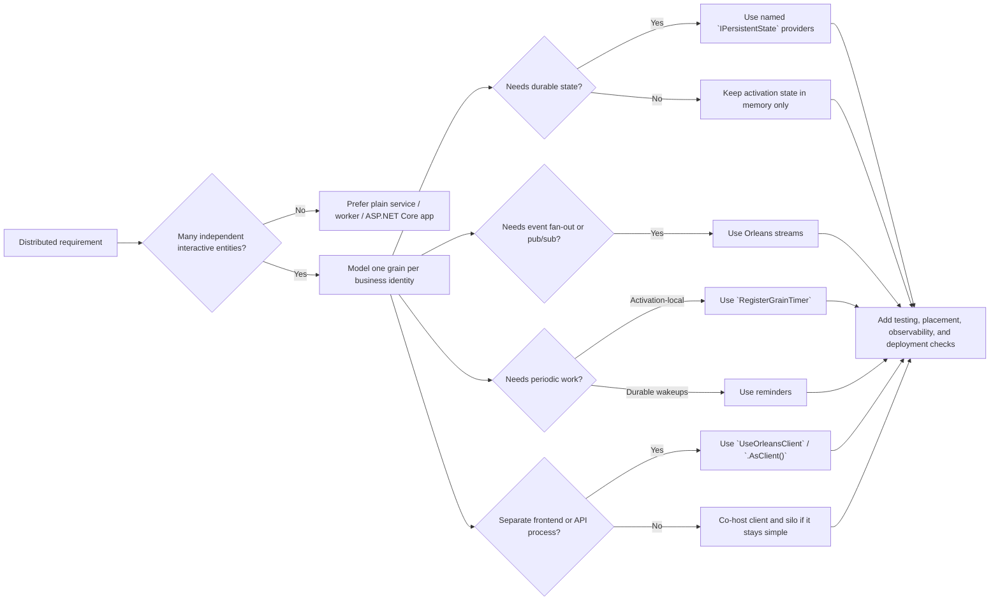

# Microsoft Orleans

## Trigger On

- building or reviewing `.NET` code that uses `Microsoft.Orleans.*`, `Grain`, `IGrainWith*`, `UseOrleans`, `UseOrleansClient`, `IGrainFactory`, or Orleans silo/client builders
- modeling high-cardinality stateful entities such as users, carts, devices, rooms, orders, digital twins, sessions, or collaborative documents
- choosing between grains, streams, reminders, stateless workers, persistence providers, placement strategies, and external client/frontend topologies
- deploying or operating Orleans with Redis, Azure Storage, Cosmos DB, ADO.NET, .NET Aspire, Kubernetes, Azure Container Apps, or built-in/dashboard observability

## Workflow

1. Decide whether Orleans is the right abstraction. Use it when the system has many loosely coupled interactive entities which can each stay small and single-threaded. Do not force Orleans onto shared-memory workloads, long batch jobs, or systems dominated by constant global coordination.
2. Model grain boundaries around business identity, not around controllers, tables, or arbitrary CRUD slices. Prefer one grain per user, cart, device, room, order, or other durable entity.
3. Keep grain APIs coarse-grained and fully asynchronous. Avoid `.Result`, `.Wait()`, blocking I/O, lock-based coordination, or long chatty call chains between grains.
4. Use current Orleans state patterns. Prefer constructor-injected `IPersistentState<TState>` with named states and named providers. Treat `Grain<TState>` as legacy unless you are constrained by existing code.
5. Pick the right runtime primitive deliberately:
   - use standard grains for stateful request/response logic
   - use `[StatelessWorker]` for pure stateless fan-out or compute helpers
   - use Orleans streams for decoupled event flow and pub/sub
   - use `RegisterGrainTimer` for activation-local periodic work
   - use reminders for durable low-frequency wakeups which must survive deactivation or restarts
6. Choose hosting intentionally. Use `UseOrleans` for silos and `UseOrleansClient` for separate clients. In Aspire, declare the Orleans resource in AppHost, wire clustering/storage/reminders there, and use `.AsClient()` for frontend-only consumers.
7. Configure providers with production realism. In-memory storage, reminders, and stream providers are for development or tests only. Prefer managed identity and `DefaultAzureCredential` for Azure-backed providers when possible.
8. Treat placement and activation movement as optimization tools, not defaults to cargo-cult. Start with the current runtime defaults and only add custom placement, rebalancing, or repartitioning when measurement shows a real locality or load problem.
9. Make the cluster observable. Add logging, OpenTelemetry, health checks, and dashboard access deliberately. If you expose the Orleans Dashboard, secure it with ASP.NET Core authorization and treat it as an operational surface.
10. Test the cluster behavior you actually depend on. Prefer `InProcessTestCluster` for new tests, add multi-silo coverage when placement, reminders, persistence, or failover behavior matters, and benchmark hot grains before claiming the design scales.

## Architecture

## Deliver

- a justified Orleans fit, or a clear rejection when the problem should stay as plain `.NET` code
- grain boundaries, grain identities, and activation behavior aligned to the domain model
- concrete choices for clustering, persistence, reminders, streams, placement, and hosting topology
- an async-safe grain API surface with bounded state and reduced hot-spot risk
- an explicit testing and observability plan for local development and production

## Validate

- Orleans is being used for many loosely coupled entities, not as a generic distributed hammer
- grain interfaces are coarse enough to avoid chatty cross-grain traffic
- no grain code blocks threads or mixes sync-over-async with runtime calls
- state is bounded, version-tolerant, and persisted only through intentional provider-backed writes
- timers are not being used where durable reminders are required, and reminders are not being used for high-frequency ticks
- in-memory storage, reminders, and stream providers are confined to dev/test usage
- Aspire projects register the required keyed backing resources before `UseOrleans()` or `UseOrleansClient()` relies on them
- hot grains, global coordinators, and affinity-heavy grains are measured and justified
- tests cover multi-silo behavior, persistence, and failover-sensitive logic when those behaviors matter

When exact wording, API shape, or long-tail coverage matters, read the smallest relevant official Orleans reference file instead of relying on the summary alone.

## References

Open only what you need:

- [official-docs-index.md](references/official-docs-index.md) - Full Orleans documentation map with direct links to the official Learn tree, quickstarts, samples, implementation details, and repository entry points
- [grains.md](references/grains.md) - Grain modeling, persistence, event sourcing, reminders, transactions, and versioning links
- [hosting.md](references/hosting.md) - Clients, Aspire, configuration, observability, dashboard, and deployment links
- [implementation.md](references/implementation.md) - Runtime internals, testing, load balancing, messaging guarantees, and resource links
- [examples.md](references/examples.md) - Quickstarts, samples browser entries, and official Orleans example hubs
- [patterns.md](references/patterns.md) - grain modeling, persistence, coordination, and distribution patterns
- [anti-patterns.md](references/anti-patterns.md) - blocking calls, unbounded state, chatty grains, and bottlenecks

Official sources:

- [GitHub Repository](https://github.com/dotnet/orleans)
- [Overview](https://learn.microsoft.com/dotnet/orleans/overview)
- [Best Practices](https://learn.microsoft.com/dotnet/orleans/resources/best-practices)
- [Grain Persistence](https://learn.microsoft.com/dotnet/orleans/grains/grain-persistence)
- [Grain Placement](https://learn.microsoft.com/dotnet/orleans/grains/grain-placement)
- [Timers and Reminders](https://learn.microsoft.com/dotnet/orleans/grains/timers-and-reminders)
- [Streaming](https://learn.microsoft.com/dotnet/orleans/streaming/)
- [Testing](https://learn.microsoft.com/dotnet/orleans/implementation/testing)
- [Orleans Dashboard](https://learn.microsoft.com/dotnet/orleans/dashboard/)
- [Orleans and .NET Aspire Integration](https://learn.microsoft.com/dotnet/orleans/host/aspire-integration)
