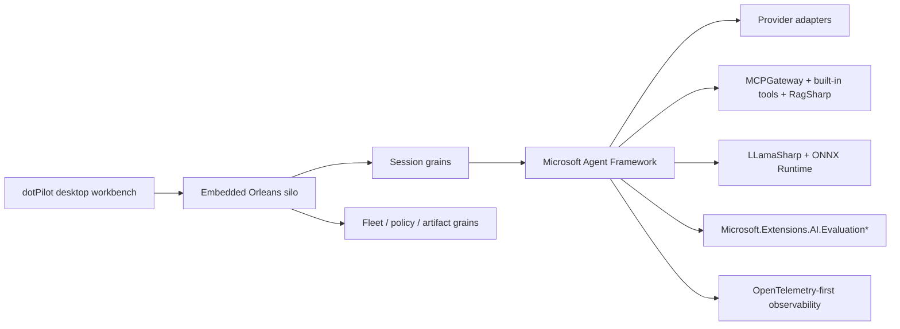

# ADR-0001: Adopt a Local-First Agent Control Plane Architecture for dotPilot

## Status

Accepted

## Date

2026-03-13

## Context

`dotPilot` currently ships as a desktop-first `Uno Platform` shell with a three-pane chat screen and a separate agent-builder view. The repository already expresses the future product IA through this shell, but the application still uses static sample data and has no durable runtime contracts for providers, sessions, agent orchestration, or evaluation.

The approved product direction is broader than a coding-only assistant:

- `dotPilot` must act as a desktop control plane for agents in general
- coding workflows remain first-class, but the same system must also support research, analysis, orchestration, reviewer, operator, and mixed-provider sessions
- the first roadmap wave is planning-only: governance, architecture, feature spec, and GitHub issue backlog
- the runtime direction must prefer MIT-licensed dependencies that materially accelerate delivery

The main architectural choice is how to shape the long-term product platform without writing implementation code in this task.

## Decision

We will treat `dotPilot` as a **local-first desktop agent control plane** with these architectural defaults:

1. The desktop app remains the primary operator surface and keeps the existing left navigation, central chat/session pane, right inspector pane, and agent-builder concepts.
2. The v1 runtime is built around an **embedded Orleans silo** hosted inside the desktop app.
3. Each operator session is modeled as a durable **session grain**, with related grains for workspace, fleet, artifact, and policy state.
4. **Microsoft Agent Framework** is the preferred orchestration layer for agent sessions, workflows, HITL, MCP-aware tool use, and OpenTelemetry-friendly observability.
5. Provider integrations are **SDK-first**:
   - `ManagedCode.CodexSharpSDK`
   - `ManagedCode.ClaudeCodeSharpSDK`
   - `GitHub.Copilot.SDK`
6. Tool federation is centered on `ManagedCode.MCPGateway`, and repository intelligence is centered on `ManagedCode.RagSharp`.
7. Quality, safety, and agent evaluation should use the official `Microsoft.Extensions.AI.Evaluation*` libraries.
8. Observability should be **OpenTelemetry-first**, aligned with Agent Framework patterns, with local visualization first and optional Azure Monitor / Foundry export later.
9. Local model support is planned through `LLamaSharp` and `ONNX Runtime`. `MLXSharp` is explicitly excluded from the first roadmap wave.

## Decision Diagram

## Alternatives Considered

### 1. Keep dotPilot focused on coding agents only

Rejected.

This would underserve the approved product scope and force future non-coding agent scenarios into an architecture that already assumed the wrong domain boundaries.

### 2. Replace the current Uno shell with a wholly new navigation and workbench concept

Rejected.

The current shell already encodes the future product information architecture. Throwing it away would create churn in planning artifacts and disconnect the backlog from the repository’s visible surface.

### 3. Use provider-specific process wrappers instead of typed SDKs where SDKs already exist

Rejected.

This would duplicate maintenance effort, weaken typed contracts, and ignore managedcode libraries that already match the preferred architecture.

### 4. Remote-first or distributed-first fleet runtime in the first wave

Rejected for the first roadmap wave.

The approved default is local-first with an embedded host. Remote fleet expansion can be planned later on top of the same contracts.

### 5. Include MLXSharp in the first runtime wave

Rejected.

The dependency is not ready for the first roadmap wave and would distract from the more stable provider and local-runtime surfaces.

## Consequences

### Positive

- The backlog is aligned with the current product shell instead of fighting it.
- The architecture is broad enough for coding and non-coding agents.
- Typed SDKs and managedcode libraries reduce integration risk and shorten delivery time.
- Agent Framework gives a consistent foundation for sessions, workflows, HITL, MCP, evaluation hooks, and observability.
- OpenTelemetry-first tracing keeps the product portable between local and cloud observability backends.

### Negative

- The target architecture is larger than the current codebase and will require a substantial implementation backlog.
- An embedded Orleans host raises startup, lifecycle, and local state-management complexity.
- Provider CLIs and SDKs each bring distinct operational prerequisites that the UI must surface clearly.
- Evaluation and observability requirements add product scope before user-visible automation features are complete.

## Implementation Impact

- Update root and local `AGENTS.md` rules to reflect the durable direction.
- Refresh `docs/Architecture.md` to show current repo structure and target boundaries.
- Add a feature spec that expresses the operator experience, flows, and Definition of Done.
- Create GitHub issues as epics plus child issues that map directly to the approved roadmap.

## References

- [Architecture Overview](../Architecture.md)
- [Feature Spec: dotPilot Agent Control Plane Experience](../Features/agent-control-plane-experience.md)
