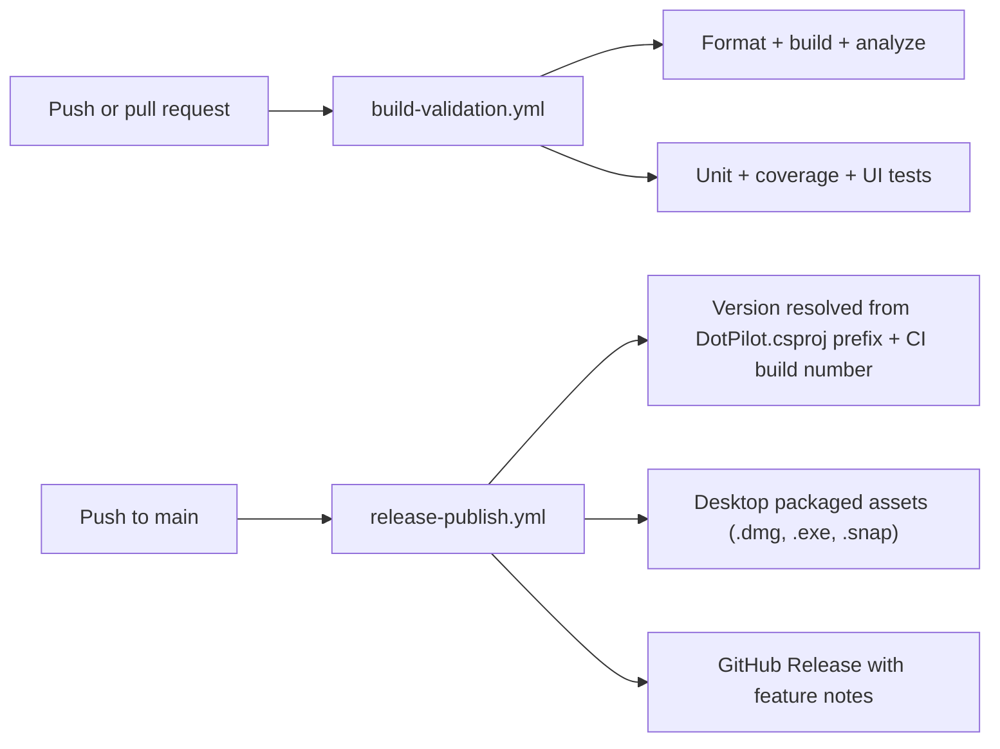

# ADR-0002: Split GitHub Actions Build Validation and Desktop Release Automation

## Status

Accepted

## Date

2026-03-13

## Context

`dotPilot` previously used a single GitHub Actions workflow file, `.github/workflows/ci.yml`, for every automation concern: formatting, build, analysis, tests, coverage, desktop publishing, and artifact uploads.

That shape no longer matches the repository workflow:

- normal validation should stay focused on build and test feedback
- release publishing has different permissions, side effects, and operator intent
- the release path now needs CI-derived version resolution from `DotPilot/DotPilot.csproj`
- desktop releases must publish platform artifacts and create a GitHub Release with feature-oriented notes

Keeping all of that in one catch-all workflow makes the automation harder to reason about, harder to secure, and harder to operate safely.

## Decision

We will split GitHub Actions into two explicit workflows:

1. `build-validation.yml`
   - owns formatting, build, analysis, unit tests, coverage, and UI tests
   - runs on normal integration events
   - does not publish desktop artifacts or create releases
2. `release-publish.yml`
   - runs automatically on pushes to `main`
   - resolves the release version from the two-segment `ApplicationDisplayVersion` prefix in `DotPilot/DotPilot.csproj` plus the GitHub Actions build number
   - publishes desktop release assets for macOS, Windows, and Linux as real packaged outputs instead of raw publish-folder archives
   - uses `.dmg` for macOS, a self-contained single-file `.exe` for Windows, and `.snap` for Linux
   - creates the GitHub Release
   - prepends repo-owned feature summaries and feature-doc links to GitHub-generated release notes

## Decision Diagram

## Alternatives Considered

### 1. Keep a single `ci.yml` for validation and release

Rejected.

This keeps unrelated concerns coupled and makes ordinary CI runs carry release-specific complexity, permissions, and naming.

### 2. Release only from manually edited tags with no version bump in the repository

Rejected.

The repository still needs a manual source-of-truth prefix in `DotPilot/DotPilot.csproj`, but the final build segment should be CI-derived so every `main` release is unique without generating a release-only source commit.

### 3. Store release notes entirely as manual workflow input

Rejected.

That makes release quality depend on operator memory instead of repo-owned history and docs. The release flow should be able to generate a meaningful baseline summary from commits and `docs/Features/`.

## Consequences

### Positive

- Validation runs are easier to understand and remain side-effect free.
- Release automation has a clear permission boundary and automatic `main` trigger.
- Desktop publish artifacts move to the workflow that actually needs them.
- Release notes now combine GitHub-generated notes with repo-owned feature context.
- Release numbers stay predictable: humans own the major/minor prefix in source and CI owns the last segment.

### Negative

- Release automation now depends on the GitHub Actions run number remaining a suitable build-number source for releases.
- The repository gains workflow-owned release logic that must stay aligned with `DotPilot.csproj`, git history, and `docs/Features/`.

## Implementation Impact

- Rename the old validation workflow to `build-validation.yml`.
- Add `release-publish.yml` with workflow-native `dotnet`/`git` steps for release-version resolution and release-summary generation.
- Update `docs/Architecture.md` and root governance rules to reference the split workflow model.

## References

- [Architecture Overview](../Architecture.md)
- [GitHub Actions Build And Release Split Plan](../../github-actions-build-release-split.plan.md)
