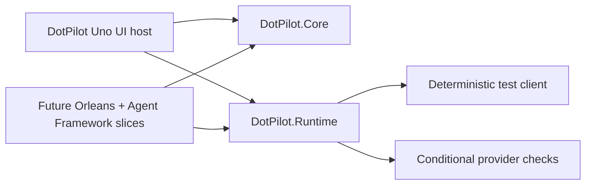

# ADR-0003: Keep the Uno App Presentation-Only and Move Feature Work into Vertical-Slice Class Libraries

## Status

Accepted

## Date

2026-03-13

## Context

`DotPilot` started as a single `Uno Platform` app project that held UI, sample models, and the first non-UI plumbing in one assembly. That structure was acceptable for a static prototype, but it does not scale to epic `#12` and the larger control-plane backlog:

- the Uno project would become a dumping ground for runtime, provider, orchestration, and persistence code
- feature work would collide in shared folders instead of staying isolated by capability
- automated validation would struggle in CI because live `Codex`, `Claude Code`, and `GitHub Copilot` toolchains are not guaranteed to exist there

The current slice needs a durable repository decision, not an ad hoc refactor, because the choice affects project boundaries, test strategy, and the backlog implementation path.

## Decision

We will use these architectural defaults for implementation work going forward:

1. `DotPilot` remains the presentation host only:
   - XAML
   - view models
   - routing
   - desktop startup
   - app composition
2. Non-UI feature work moves into separate class libraries:
   - `DotPilot.Core` for contracts, typed identifiers, and public slice interfaces
   - `DotPilot.Runtime` for provider-independent runtime implementations and future host integration seams
3. Feature code must be organized as vertical slices under `Features/<FeatureName>/...`, not as shared horizontal `Services`, `Models`, or `Helpers` buckets.
4. Epic `#12` starts with a `RuntimeFoundation` slice that sequences issues `#22`, `#23`, `#24`, and `#25` behind a stable contract surface before live Orleans or provider integration.
5. CI-safe agent-flow verification must use a deterministic in-repo runtime client as a first-class implementation of the same public contracts, not a mock or hand-wired test double.
6. Tests that require real `Codex`, `Claude Code`, or `GitHub Copilot` toolchains may run only when the corresponding toolchain is available; their absence must not weaken the provider-independent baseline.

## Decision Diagram

## Alternatives Considered

### 1. Keep everything inside the `DotPilot` app project

Rejected.

This would make the Uno project a mixed UI/runtime assembly and guarantee churn as more features land.

### 2. Split by horizontal layers such as `Models`, `Services`, and `Infrastructure`

Rejected.

That structure hides feature ownership and makes it harder to isolate a single backlog slice end to end.

### 3. Depend on live provider CLIs in all automated tests

Rejected.

CI does not guarantee those toolchains, so the repo would lose an honest agent-flow baseline.

## Consequences

### Positive

- The Uno app gets cleaner and stays focused on operator-facing concerns.
- Future slices can land without merging unrelated feature logic into shared buckets.
- Contracts for `#12` become reusable across UI, runtime, and tests.
- CI keeps a real provider-independent verification path through the deterministic runtime client.

### Negative

- The solution now has more projects and local governance files to maintain.
- Some pre-existing non-UI files in the app project may need follow-up cleanup as more slices move out.
- The deterministic client adds maintenance work even though it is not a live provider adapter.

## Implementation Impact

- Add `DotPilot.Core` and `DotPilot.Runtime` with local `AGENTS.md` files.
- Update `docs/Architecture.md` to show the new module map and runtime-foundation slice.
- Surface the runtime-foundation slice in the UI so the new boundary is visible and testable.
- Add API-style tests for contracts and the deterministic client.
- Add UI tests for the runtime-foundation elements and full workbench flow.

## References

- [Architecture Overview](../Architecture.md)
- [ADR-0001: Local-First Agent Control Plane Architecture](./ADR-0001-agent-control-plane-architecture.md)
- [Feature Spec: dotPilot Agent Control Plane Experience](../Features/agent-control-plane-experience.md)
