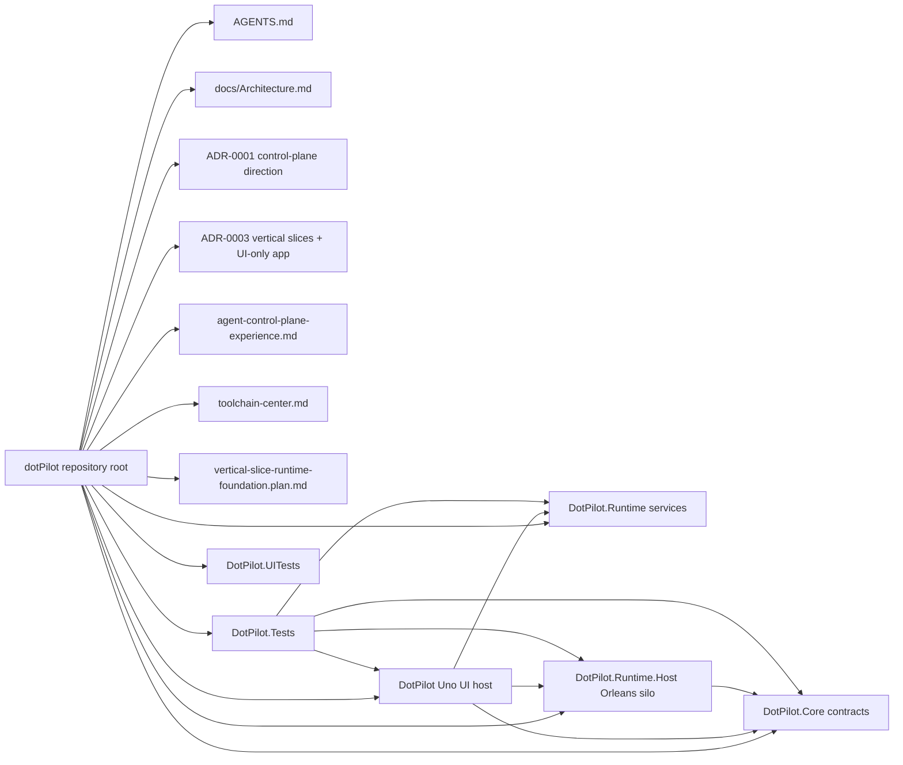
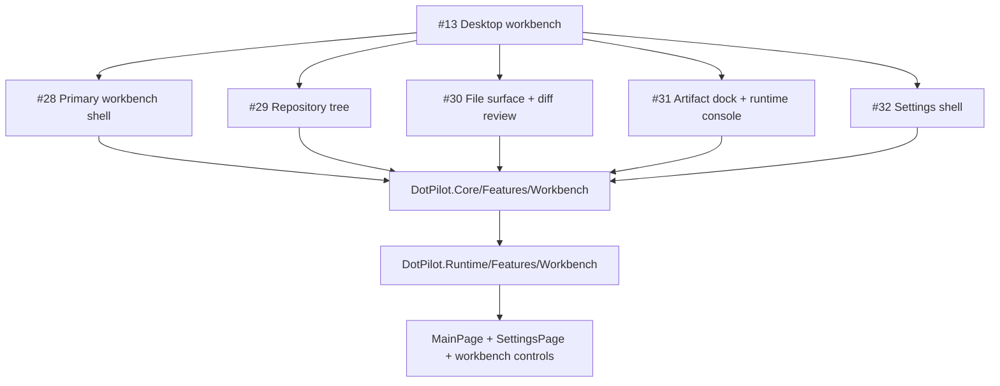
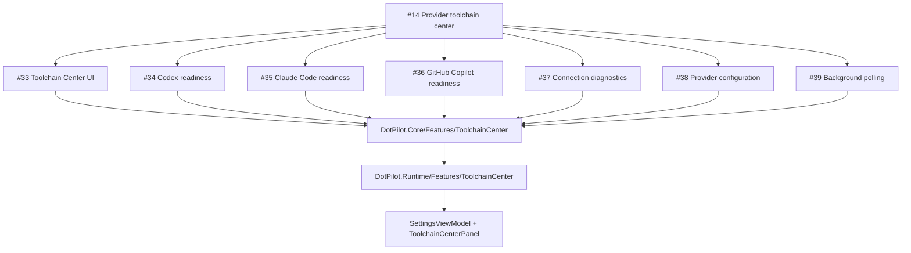
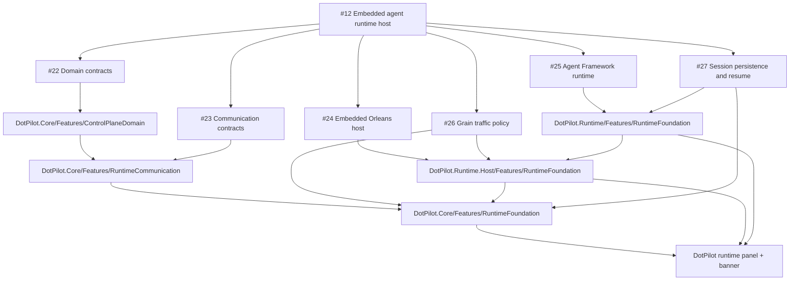
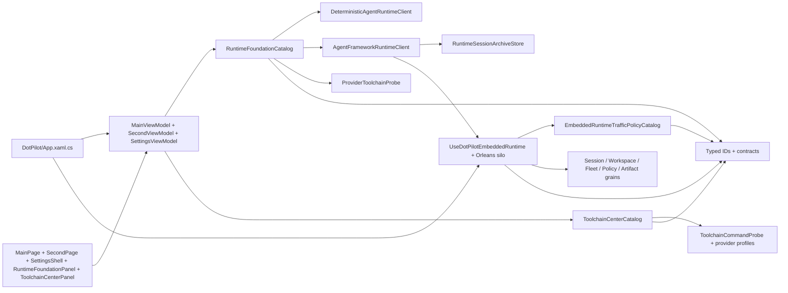

# Architecture Overview

Goal: give humans and agents a fast map of the active `DotPilot` solution, the current `Uno Platform` shell, the workbench foundation for epic `#13`, the Toolchain Center for epic `#14`, and the local-first runtime foundation for epic `#12`.

This file is the required start-here architecture map for non-trivial tasks.

## Summary

- **System:** `DotPilot` is a `.NET 10` `Uno Platform` desktop-first application that is evolving from a static prototype into a local-first control plane for agent operations.
- **Presentation boundary:** [../DotPilot/](../DotPilot/) is now the presentation host only. It owns XAML, routing, desktop startup, and UI composition, while non-UI feature logic moves into separate DLLs.
- **Workbench boundary:** epic [#13](https://github.com/managedcode/dotPilot/issues/13) is landing as a `Workbench` slice that will provide repository navigation, file inspection, artifact and log inspection, and a unified settings shell without moving that behavior into page code-behind.
- **Toolchain Center boundary:** epic [#14](https://github.com/managedcode/dotPilot/issues/14) now lives as a `ToolchainCenter` slice. [../DotPilot.Core/Features/ToolchainCenter](../DotPilot.Core/Features/ToolchainCenter) defines the readiness, diagnostics, configuration, action, and polling contracts; [../DotPilot.Runtime/Features/ToolchainCenter](../DotPilot.Runtime/Features/ToolchainCenter) probes local provider CLIs for `Codex`, `Claude Code`, and `GitHub Copilot`; the Uno app surfaces the slice through the settings shell.
- **Runtime foundation boundary:** [../DotPilot.Core/](../DotPilot.Core/) owns issue-aligned contracts, typed identifiers, grain interfaces, traffic-policy snapshots, and session-archive contracts; [../DotPilot.Runtime/](../DotPilot.Runtime/) owns provider-independent runtime implementations such as the deterministic turn engine, `Microsoft Agent Framework` orchestration client, and local archive persistence; [../DotPilot.Runtime.Host/](../DotPilot.Runtime.Host/) owns the embedded Orleans host, explicit grain traffic policy, and initial grain implementations for desktop targets.
- **Domain slice boundary:** issue [#22](https://github.com/managedcode/dotPilot/issues/22) now lives in `DotPilot.Core/Features/ControlPlaneDomain`, which defines the shared agent, session, fleet, provider, runtime, approval, artifact, telemetry, and evaluation model that later slices reuse.
- **Communication slice boundary:** issue [#23](https://github.com/managedcode/dotPilot/issues/23) lives in `DotPilot.Core/Features/RuntimeCommunication`, which defines the shared `ManagedCode.Communication` result/problem language for runtime public boundaries.
- **First implementation slice:** epic [#12](https://github.com/managedcode/dotPilot/issues/12) is represented locally through the `RuntimeFoundation` slice, which now sequences issues `#22`, `#23`, `#24`, `#25`, `#26`, and `#27` behind a stable contract surface instead of mixing runtime work into the Uno app.
- **Automated verification:** [../DotPilot.Tests/](../DotPilot.Tests/) covers API-style and contract flows through the new DLL boundaries; [../DotPilot.UITests/](../DotPilot.UITests/) covers the visible workbench flow, Toolchain Center, and runtime-foundation UI surface. Provider-independent flows must pass in CI through deterministic or environment-agnostic checks, while provider-specific checks can run only when the matching toolchain is available.

## Scoping

- **In scope for the current repository state:** the Uno workbench shell, the `DotPilot.Core`, `DotPilot.Runtime`, and `DotPilot.Runtime.Host` libraries, the embedded Orleans host for local desktop runtime state, and the automated validation boundaries around them.
- **In scope for future implementation:** provider adapters, durable persistence beyond the current local session archive, telemetry, evaluation, Git tooling, and local runtimes.
- **Out of scope in the current slice:** remote workers, remote clustering, external durable storage providers, and cloud-only control-plane services.

## Diagrams

### Solution module map

### Workbench foundation slice for epic #13

### Toolchain Center slice for epic #14

### Runtime foundation slice for epic #12

### Current composition flow

## Navigation Index

### Planning and decision docs

- `Solution governance` — [../AGENTS.md](../AGENTS.md)
- `Task plan` — [../epic-12-embedded-runtime.plan.md](../epic-12-embedded-runtime.plan.md)
- `Primary architecture decision` — [ADR-0001](./ADR/ADR-0001-agent-control-plane-architecture.md)
- `Vertical-slice solution decision` — [ADR-0003](./ADR/ADR-0003-vertical-slices-and-ui-only-uno-app.md)
- `Feature spec` — [Agent Control Plane Experience](./Features/agent-control-plane-experience.md)
- `Issue #13 feature doc` — [Workbench Foundation](./Features/workbench-foundation.md)
- `Issue #14 feature doc` — [Toolchain Center](./Features/toolchain-center.md)
- `Issue #22 feature doc` — [Control Plane Domain Model](./Features/control-plane-domain-model.md)
- `Issue #23 feature doc` — [Runtime Communication Contracts](./Features/runtime-communication-contracts.md)
- `Issue #24 feature doc` — [Embedded Orleans Host](./Features/embedded-orleans-host.md)
- `Issues #25-#27 feature doc` — [Embedded Runtime Orchestration](./Features/embedded-runtime-orchestration.md)

### Modules

- `Production Uno app` — [../DotPilot/](../DotPilot/)
- `Contracts and typed identifiers` — [../DotPilot.Core/](../DotPilot.Core/)
- `Provider-independent runtime services` — [../DotPilot.Runtime/](../DotPilot.Runtime/)
- `Embedded Orleans runtime host` — [../DotPilot.Runtime.Host/](../DotPilot.Runtime.Host/)
- `Unit and API-style tests` — [../DotPilot.Tests/](../DotPilot.Tests/)
- `UI tests` — [../DotPilot.UITests/](../DotPilot.UITests/)
- `Shared build and analyzer policy` — [../Directory.Build.props](../Directory.Build.props), [../Directory.Packages.props](../Directory.Packages.props), [../global.json](../global.json), and [../.editorconfig](../.editorconfig)

### High-signal code paths

- `Application startup and composition` — [../DotPilot/App.xaml.cs](../DotPilot/App.xaml.cs)
- `Chat workbench view model` — [../DotPilot/Presentation/MainViewModel.cs](../DotPilot/Presentation/MainViewModel.cs)
- `Settings view model` — [../DotPilot/Presentation/SettingsViewModel.cs](../DotPilot/Presentation/SettingsViewModel.cs)
- `Agent builder view model` — [../DotPilot/Presentation/SecondViewModel.cs](../DotPilot/Presentation/SecondViewModel.cs)
- `Toolchain Center panel` — [../DotPilot/Presentation/Controls/ToolchainCenterPanel.xaml](../DotPilot/Presentation/Controls/ToolchainCenterPanel.xaml)
- `Reusable runtime panel` — [../DotPilot/Presentation/Controls/RuntimeFoundationPanel.xaml](../DotPilot/Presentation/Controls/RuntimeFoundationPanel.xaml)
- `Toolchain Center contracts` — [../DotPilot.Core/Features/ToolchainCenter/ToolchainCenterContracts.cs](../DotPilot.Core/Features/ToolchainCenter/ToolchainCenterContracts.cs)
- `Toolchain Center issue catalog` — [../DotPilot.Core/Features/ToolchainCenter/ToolchainCenterIssues.cs](../DotPilot.Core/Features/ToolchainCenter/ToolchainCenterIssues.cs)
- `Shell configuration contract` — [../DotPilot.Core/Features/ApplicationShell/AppConfig.cs](../DotPilot.Core/Features/ApplicationShell/AppConfig.cs)
- `Runtime foundation contracts` — [../DotPilot.Core/Features/RuntimeFoundation/RuntimeFoundationContracts.cs](../DotPilot.Core/Features/RuntimeFoundation/RuntimeFoundationContracts.cs)
- `Embedded runtime host contracts` — [../DotPilot.Core/Features/RuntimeFoundation/EmbeddedRuntimeHostContracts.cs](../DotPilot.Core/Features/RuntimeFoundation/EmbeddedRuntimeHostContracts.cs)
- `Traffic policy contracts` — [../DotPilot.Core/Features/RuntimeFoundation/EmbeddedRuntimeTrafficPolicyContracts.cs](../DotPilot.Core/Features/RuntimeFoundation/EmbeddedRuntimeTrafficPolicyContracts.cs)
- `Session archive contracts` — [../DotPilot.Core/Features/RuntimeFoundation/RuntimeSessionArchiveContracts.cs](../DotPilot.Core/Features/RuntimeFoundation/RuntimeSessionArchiveContracts.cs)
- `Runtime communication problems` — [../DotPilot.Core/Features/RuntimeCommunication/RuntimeCommunicationProblems.cs](../DotPilot.Core/Features/RuntimeCommunication/RuntimeCommunicationProblems.cs)
- `Control-plane domain contracts` — [../DotPilot.Core/Features/ControlPlaneDomain/SessionExecutionContracts.cs](../DotPilot.Core/Features/ControlPlaneDomain/SessionExecutionContracts.cs)
- `Provider and tool contracts` — [../DotPilot.Core/Features/ControlPlaneDomain/ProviderAndToolContracts.cs](../DotPilot.Core/Features/ControlPlaneDomain/ProviderAndToolContracts.cs)
- `Runtime issue catalog` — [../DotPilot.Core/Features/RuntimeFoundation/RuntimeFoundationIssues.cs](../DotPilot.Core/Features/RuntimeFoundation/RuntimeFoundationIssues.cs)
- `Toolchain Center catalog implementation` — [../DotPilot.Runtime/Features/ToolchainCenter/ToolchainCenterCatalog.cs](../DotPilot.Runtime/Features/ToolchainCenter/ToolchainCenterCatalog.cs)
- `Toolchain snapshot factory` — [../DotPilot.Runtime/Features/ToolchainCenter/ToolchainProviderSnapshotFactory.cs](../DotPilot.Runtime/Features/ToolchainCenter/ToolchainProviderSnapshotFactory.cs)
- `Runtime catalog implementation` — [../DotPilot.Runtime/Features/RuntimeFoundation/RuntimeFoundationCatalog.cs](../DotPilot.Runtime/Features/RuntimeFoundation/RuntimeFoundationCatalog.cs)
- `Deterministic test client` — [../DotPilot.Runtime/Features/RuntimeFoundation/DeterministicAgentRuntimeClient.cs](../DotPilot.Runtime/Features/RuntimeFoundation/DeterministicAgentRuntimeClient.cs)
- `Agent Framework client` — [../DotPilot.Runtime/Features/RuntimeFoundation/AgentFrameworkRuntimeClient.cs](../DotPilot.Runtime/Features/RuntimeFoundation/AgentFrameworkRuntimeClient.cs)
- `Deterministic turn engine` — [../DotPilot.Runtime/Features/RuntimeFoundation/DeterministicAgentTurnEngine.cs](../DotPilot.Runtime/Features/RuntimeFoundation/DeterministicAgentTurnEngine.cs)
- `Session archive store` — [../DotPilot.Runtime/Features/RuntimeFoundation/RuntimeSessionArchiveStore.cs](../DotPilot.Runtime/Features/RuntimeFoundation/RuntimeSessionArchiveStore.cs)
- `Provider toolchain probing` — [../DotPilot.Runtime/Features/RuntimeFoundation/ProviderToolchainProbe.cs](../DotPilot.Runtime/Features/RuntimeFoundation/ProviderToolchainProbe.cs)
- `Embedded host builder` — [../DotPilot.Runtime.Host/Features/RuntimeFoundation/EmbeddedRuntimeHostBuilderExtensions.cs](../DotPilot.Runtime.Host/Features/RuntimeFoundation/EmbeddedRuntimeHostBuilderExtensions.cs)
- `Embedded traffic policy` — [../DotPilot.Runtime.Host/Features/RuntimeFoundation/EmbeddedRuntimeTrafficPolicy.cs](../DotPilot.Runtime.Host/Features/RuntimeFoundation/EmbeddedRuntimeTrafficPolicy.cs)
- `Embedded traffic-policy catalog` — [../DotPilot.Runtime.Host/Features/RuntimeFoundation/EmbeddedRuntimeTrafficPolicyCatalog.cs](../DotPilot.Runtime.Host/Features/RuntimeFoundation/EmbeddedRuntimeTrafficPolicyCatalog.cs)
- `Initial Orleans grains` — [../DotPilot.Runtime.Host/Features/RuntimeFoundation/SessionGrain.cs](../DotPilot.Runtime.Host/Features/RuntimeFoundation/SessionGrain.cs)

## Dependency Rules

- `DotPilot` owns XAML, routing, and startup composition only.
- `DotPilot.Core` owns non-UI contracts and typed identifiers arranged by feature slice.
- `DotPilot.Runtime` owns provider-independent runtime implementations and future integration seams, but not XAML or page logic.
- `DotPilot.Runtime.Host` owns the embedded Orleans silo, localhost clustering, in-memory runtime state, and initial grain implementations for desktop targets only.
- `DotPilot.Tests` validates contracts, composition, deterministic runtime behavior, and conditional provider-availability checks through public boundaries.
- `DotPilot.UITests` validates the visible workbench shell, runtime-foundation panel, and agent-builder flow through the browser-hosted UI.

## Key Decisions

- The Uno app must remain a presentation-only host instead of becoming a dump for runtime logic.
- Feature work should land as vertical slices with isolated contracts and implementations, not as shared horizontal folders.
- Epic `#12` now has a first local-first Orleans host cut in `DotPilot.Runtime.Host`, and it intentionally uses localhost clustering plus in-memory storage/reminders before any remote or durable runtime topology is introduced.
- The desktop runtime path now uses `Microsoft Agent Framework` for orchestration, while the browser path keeps the deterministic in-repo client for CI-safe coverage.
- `#26` currently uses an explicit traffic-policy catalog plus Mermaid graph output instead of `ManagedCode.Orleans.Graph`, because the public `ManagedCode.Orleans.Graph` package is pinned to Orleans `9.x` and is not compatible with this repository's Orleans `10.0.1` baseline.
- Epic `#14` makes external-provider toolchain readiness explicit before session creation, so install, auth, diagnostics, and configuration state stays visible instead of being inferred later.
- CI must stay meaningful without external provider CLIs by using the in-repo deterministic runtime client.
- Real provider checks may run only when the corresponding toolchain is present and discoverable.

## Known Repository Risks

- Provider-dependent validation for real `Codex`, `Claude Code`, and `GitHub Copilot` toolchains is intentionally environment-gated; the deterministic runtime client is the mandatory CI baseline for agent-flow verification.

## Where To Go Next

- Editing the Uno app shell: [../DotPilot/AGENTS.md](../DotPilot/AGENTS.md)
- Editing contracts: [../DotPilot.Core/AGENTS.md](../DotPilot.Core/AGENTS.md)
- Editing runtime services: [../DotPilot.Runtime/AGENTS.md](../DotPilot.Runtime/AGENTS.md)
- Editing the embedded runtime host: [../DotPilot.Runtime.Host/AGENTS.md](../DotPilot.Runtime.Host/AGENTS.md)
- Editing unit and API-style tests: [../DotPilot.Tests/AGENTS.md](../DotPilot.Tests/AGENTS.md)
- Editing UI tests: [../DotPilot.UITests/AGENTS.md](../DotPilot.UITests/AGENTS.md)
