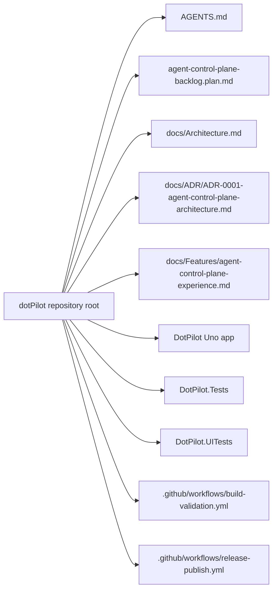
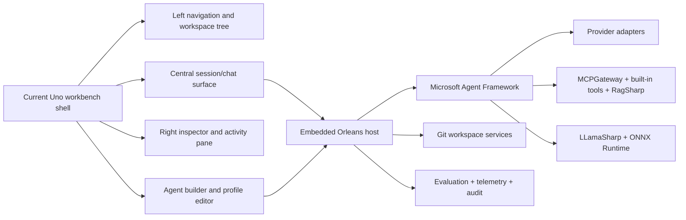
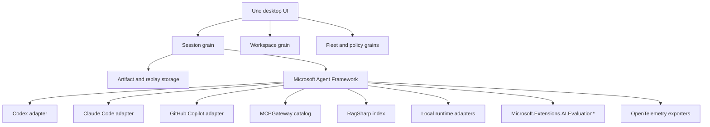

# Architecture Overview

Goal: give humans and agents a fast map of the active `DotPilot` solution, the current `Uno Platform` shell, and the target control-plane boundaries that the backlog now plans to deliver.

This file is the required start-here architecture map for non-trivial tasks.

## Summary

- **System:** `DotPilot` is a `.NET 10` `Uno Platform` desktop-first application that is evolving from a static prototype into a local-first control plane for agent operations.
- **Current product shell:** [../DotPilot/](../DotPilot/) already contains the visual workbench concepts that future work must preserve: a left navigation shell, a central session surface, a right-side inspector, and a separate agent-builder surface.
- **Target runtime direction:** the planned product architecture uses an embedded `Orleans` silo, `Microsoft Agent Framework` orchestration, provider adapters for external agent runtimes, local runtime adapters, `MCPGateway` for tool federation, `RagSharp` for repo intelligence, and OpenTelemetry-first observability.
- **Planning artifacts:** the control-plane direction is captured in [ADR-0001](./ADR/ADR-0001-agent-control-plane-architecture.md), the CI/release workflow split is captured in [ADR-0002](./ADR/ADR-0002-split-github-actions-build-and-release.md), and the operator experience is captured in [agent-control-plane-experience.md](./Features/agent-control-plane-experience.md).
- **Automated verification today:** [../DotPilot.Tests/](../DotPilot.Tests/) contains in-process `NUnit` tests, [../DotPilot.UITests/](../DotPilot.UITests/) contains browser-driven `Uno.UITest` UI coverage, GitHub Actions `Build Validation` gates normal changes, and `Desktop Release` runs automatically on pushes to `main` to publish desktop artifacts and create the GitHub Release.

## Scoping

- **In scope for current planning:** governance, docs, backlog structure, current shell mapping, target control-plane boundaries, and repo-level planning artifacts.
- **In scope for future implementation:** embedded runtime host, provider toolchains, session orchestration, MCP/tools, repo intelligence, Git flows, local runtimes, telemetry, evaluation, and replay.
- **Out of scope in the current repository state:** production backend services, external fleet workers, and cloud-only control-plane dependencies.

## Diagrams

### Repository and planning map

### Current product shell to target control-plane boundaries

### Planned runtime and contract map

## Navigation Index

### Planning and decision docs

- `Solution governance` — [../AGENTS.md](../AGENTS.md)
- `Task plan` — [../agent-control-plane-backlog.plan.md](../agent-control-plane-backlog.plan.md)
- `Architecture decision` — [ADR-0001](./ADR/ADR-0001-agent-control-plane-architecture.md)
- `Release automation decision` — [ADR-0002](./ADR/ADR-0002-split-github-actions-build-and-release.md)
- `Feature spec` — [Agent Control Plane Experience](./Features/agent-control-plane-experience.md)

### Modules

- `Production Uno app` — [../DotPilot/](../DotPilot/)
- `Unit tests` — [../DotPilot.Tests/](../DotPilot.Tests/)
- `UI tests` — [../DotPilot.UITests/](../DotPilot.UITests/)
- `CI build validation` — [../.github/workflows/build-validation.yml](../.github/workflows/build-validation.yml)
- `Desktop release automation` — [../.github/workflows/release-publish.yml](../.github/workflows/release-publish.yml)
- `Shared build and analyzer policy` — [../Directory.Build.props](../Directory.Build.props), [../Directory.Packages.props](../Directory.Packages.props), [../global.json](../global.json), and [../.editorconfig](../.editorconfig)

### High-signal code paths in the current shell

- `Application startup and route registration` — [../DotPilot/App.xaml.cs](../DotPilot/App.xaml.cs)
- `Desktop startup host` — [../DotPilot/Platforms/Desktop/Program.cs](../DotPilot/Platforms/Desktop/Program.cs)
- `Shell` — [../DotPilot/Presentation/Shell.xaml](../DotPilot/Presentation/Shell.xaml)
- `Session surface prototype` — [../DotPilot/Presentation/MainPage.xaml](../DotPilot/Presentation/MainPage.xaml)
- `Agent profile prototype` — [../DotPilot/Presentation/SecondPage.xaml](../DotPilot/Presentation/SecondPage.xaml)
- `Workbench sidebar` — [../DotPilot/Presentation/Controls/ChatSidebar.xaml](../DotPilot/Presentation/Controls/ChatSidebar.xaml)
- `Session conversation view` — [../DotPilot/Presentation/Controls/ChatConversationView.xaml](../DotPilot/Presentation/Controls/ChatConversationView.xaml)
- `Inspector panel` — [../DotPilot/Presentation/Controls/ChatInfoPanel.xaml](../DotPilot/Presentation/Controls/ChatInfoPanel.xaml)
- `Agent builder sidebar` — [../DotPilot/Presentation/Controls/AgentSidebar.xaml](../DotPilot/Presentation/Controls/AgentSidebar.xaml)

## Dependency Rules

- `DotPilot` owns the desktop shell, startup, navigation, and future control-plane presentation work.
- `DotPilot.Tests` validates in-process contracts and behavior-focused logic.
- `DotPilot.UITests` validates the visible workbench shell and operator flows through the browser-hosted surface.
- Future provider, orchestration, telemetry, and evaluation work must align with the planning docs before implementation begins.
- `MLXSharp` is intentionally excluded from the first roadmap wave even though local runtimes are in scope through `LLamaSharp` and `ONNX Runtime`.

## Key Decisions

- `dotPilot` is now positioned as a general agent control plane rather than a coding-only shell.
- The current shell layout is the basis for the future product and should be evolved rather than discarded.
- The preferred runtime direction is an embedded `Orleans` host with `Microsoft Agent Framework`.
- Provider integrations are SDK-first where viable.
- Evaluation should use `Microsoft.Extensions.AI.Evaluation*`, and observability should be OpenTelemetry-first.
- GitHub Actions now separates validation from release so normal CI stays fast and side-effect free while release automation owns desktop publishing and GitHub Release publication on `main`.
- Desktop release versions are derived from the two-segment `ApplicationDisplayVersion` prefix in `DotPilot.csproj` plus the CI build number as the final segment.

## Known Repository Risks

- The current baseline `dotnet build DotPilot.slnx` is not fully green on this machine because `Uno.Resizetizer` hits a file lock on `icon_foreground.png` during the `net10.0` build. This is a known repo risk documented in [../agent-control-plane-backlog.plan.md](../agent-control-plane-backlog.plan.md).

## Where To Go Next

- Editing the Uno app shell: [../DotPilot/AGENTS.md](../DotPilot/AGENTS.md)
- Editing unit tests: [../DotPilot.Tests/AGENTS.md](../DotPilot.Tests/AGENTS.md)
- Editing UI tests: [../DotPilot.UITests/AGENTS.md](../DotPilot.UITests/AGENTS.md)
- Reviewing the architectural decision: [ADR-0001](./ADR/ADR-0001-agent-control-plane-architecture.md)
- Reviewing the implementation-driving feature spec: [Agent Control Plane Experience](./Features/agent-control-plane-experience.md)
