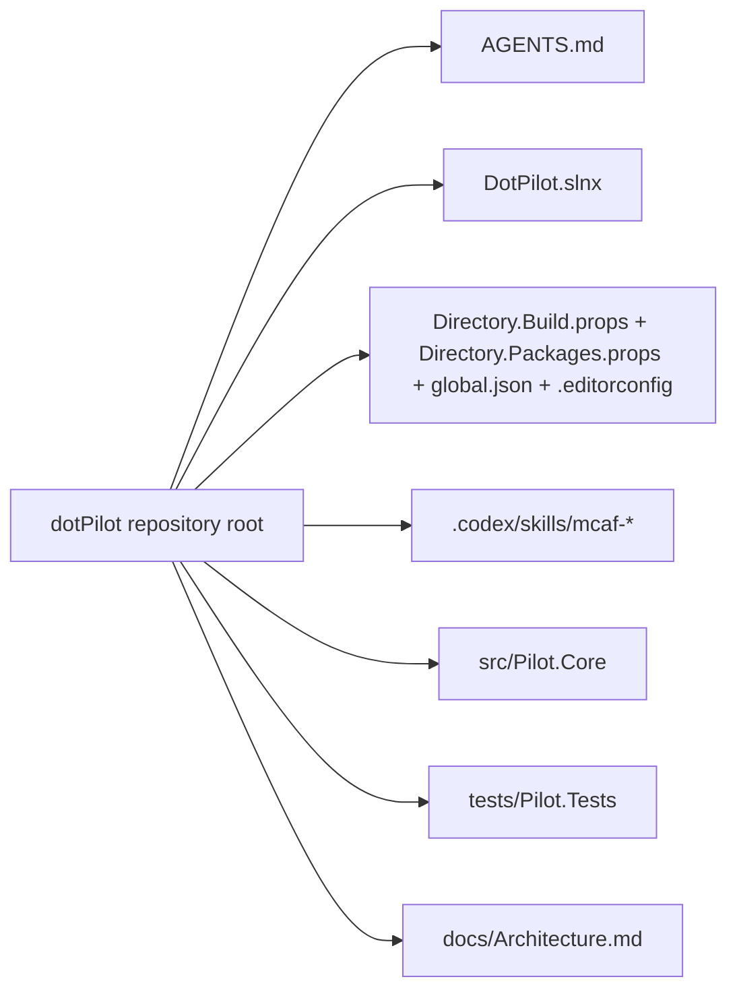
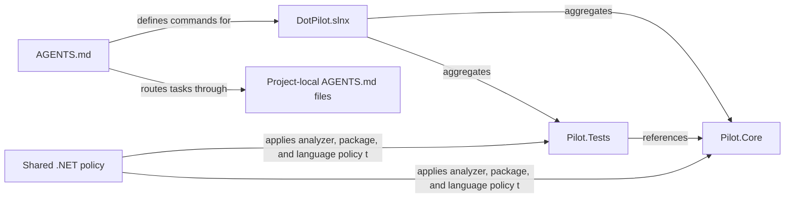
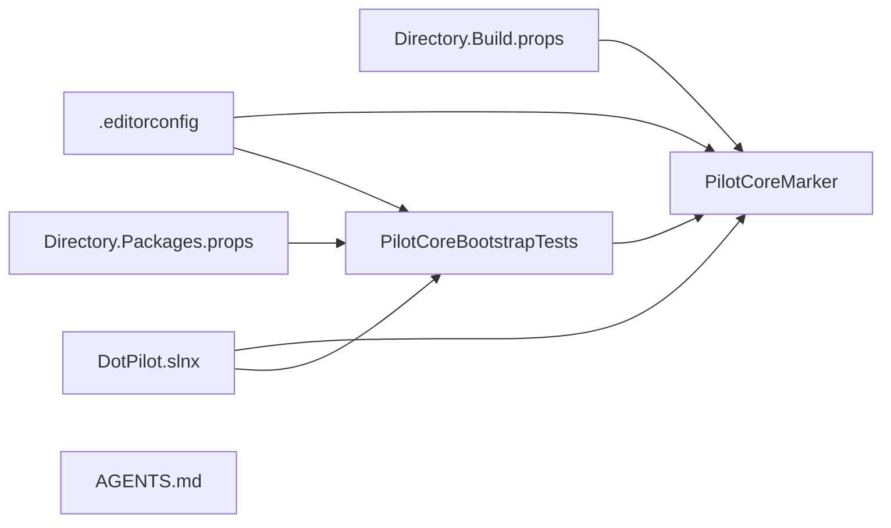

# Architecture Overview

Goal: in a few minutes, understand what exists in this repository today, where the production and test projects live, and which repo-level artifacts agents must trust first.

This file is the primary start-here card for humans and AI agents.

Single source of truth: keep this doc navigational and coarse. Detailed behavior belongs in `docs/Features/*`, and durable architectural decisions belong in `docs/ADR/*` once those documents exist.

## Summary

- **System:** `dotPilot` is an agent-facing UI solution scaffold built on `.NET 10`, with one production class library and one TUnit-based test project.
- **Where is the code:** production code lives in [../src/Pilot.Core/](../src/Pilot.Core/), and tests live in [../tests/Pilot.Tests/](../tests/Pilot.Tests/).
- **Entry points:** [../AGENTS.md](../AGENTS.md), [../DotPilot.slnx](../DotPilot.slnx), [../src/Pilot.Core/PilotCoreMarker.cs](../src/Pilot.Core/PilotCoreMarker.cs), and [../tests/Pilot.Tests/PilotCoreBootstrapTests.cs](../tests/Pilot.Tests/PilotCoreBootstrapTests.cs).
- **Dependencies:** `.NET SDK 10`, the repo-root [../.editorconfig](../.editorconfig), [../Directory.Build.props](../Directory.Build.props), [../Directory.Packages.props](../Directory.Packages.props), [../global.json](../global.json), `TUnit 1.19.16`, and `Microsoft.Testing.Platform`.

## Scoping

- **In scope:** repository bootstrap, root governance, shared .NET policy, solution layout, and the minimum docs future agents need before editing code.
- **Out of scope:** runtime agent protocol details, UI feature behavior, deployment topology, and any project-specific architecture that does not exist yet.
- Pick impacted repo artifact(s) from the diagrams and navigation index below.
- Read only the linked files that define the affected behavior.
- If the task cannot be mapped to this doc, update it first.

## Diagrams

These diagrams model the current bootstrap topology that future UI projects will extend.

### System / module map

### Interfaces / contracts map

### Key repository artifacts map

## Navigation Index

### Modules

- `Solution governance` — code and policy: [../AGENTS.md](../AGENTS.md)
- `Solution file` — root .NET solution scaffold: [../DotPilot.slnx](../DotPilot.slnx)
- `Production library` — reusable production code: [../src/Pilot.Core/](../src/Pilot.Core/)
- `Test project` — TUnit verification: [../tests/Pilot.Tests/](../tests/Pilot.Tests/)
- `Shared build policy` — analyzer, language, and warning defaults: [../Directory.Build.props](../Directory.Build.props), [../Directory.Packages.props](../Directory.Packages.props), [../global.json](../global.json), and [../.editorconfig](../.editorconfig)
- `Shared package policy` — centrally managed package versions: [../Directory.Packages.props](../Directory.Packages.props)
- `Repo-local skill catalog` — installed MCAF skills for Codex: [../.codex/skills/](../.codex/skills/)
- `Architecture overview` — this file: [Architecture.md](./Architecture.md)

### Interfaces / contracts

- `Agent workflow contract` — source of truth: [../AGENTS.md](../AGENTS.md); producer: repository governance; consumer: any human or AI agent working in this repo
- `Shared .NET policy contract` — source of truth: [../Directory.Build.props](../Directory.Build.props), [../Directory.Packages.props](../Directory.Packages.props), [../global.json](../global.json), and [../.editorconfig](../.editorconfig); producer: solution root; consumer: all current and future .NET projects
- `Solution membership contract` — source of truth: [../DotPilot.slnx](../DotPilot.slnx); producer: solution root; consumer: the `Pilot.Core` and `Pilot.Tests` project roots
- `Test-to-core contract` — source of truth: [../tests/Pilot.Tests/Pilot.Tests.csproj](../tests/Pilot.Tests/Pilot.Tests.csproj); producer: `Pilot.Tests`; consumer: `Pilot.Core`

### Key classes / types

- `PilotCoreMarker` — defined in: [../src/Pilot.Core/PilotCoreMarker.cs](../src/Pilot.Core/PilotCoreMarker.cs); used by: `Pilot.Tests`
- `PilotCoreBootstrapTests` — defined in: [../tests/Pilot.Tests/PilotCoreBootstrapTests.cs](../tests/Pilot.Tests/PilotCoreBootstrapTests.cs); uses: `Pilot.Core`

## Dependency Rules

- Allowed dependencies: `Pilot.Core` may depend on repo-root .NET policy only; `Pilot.Tests` may depend on `Pilot.Core`, `TUnit`, and test-only extensions managed through `Directory.Packages.props`.
- Forbidden dependencies: do not add UI-specific frameworks to `Pilot.Core`, and do not add additional test frameworks beside `TUnit`.
- Integration style: root governance drives future code changes through documented commands, local `AGENTS.md` files, and centrally managed packages.
- Shared code policy: shared .NET defaults belong in repo-root policy files, while project-specific overrides belong in local `AGENTS.md` files or project files.

## Key Decisions

- The repository uses one root `AGENTS.md` and will add local `AGENTS.md` files per project or module once those roots exist.
- The repo-local agent skill directory is `.codex/skills/` and must contain only current `mcaf-*` skills.
- The root `.editorconfig` remains the source of truth for formatting, naming, style, and analyzer severity.
- `Directory.Build.props` carries shared analyzer, warning, and language policy for future `.NET` projects.
- `Directory.Packages.props` carries centrally managed package versions.
- `global.json` opts the solution into the `.NET 10` Microsoft.Testing.Platform test runner experience.
- `TUnit` is the only test framework in this repository and runs on `Microsoft.Testing.Platform`.

## Where To Go Next

- Root workflow and commands: [../AGENTS.md](../AGENTS.md)
- Shared .NET policy: [../Directory.Build.props](../Directory.Build.props), [../Directory.Packages.props](../Directory.Packages.props), [../global.json](../global.json), and [../.editorconfig](../.editorconfig)
- Skill catalog: [../.codex/skills/](../.codex/skills/)
- Solution scaffold: [../DotPilot.slnx](../DotPilot.slnx)
- Production code: [../src/Pilot.Core/](../src/Pilot.Core/)
- Tests: [../tests/Pilot.Tests/](../tests/Pilot.Tests/)
