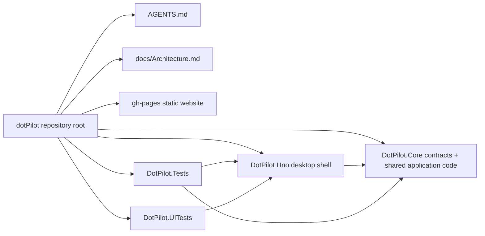
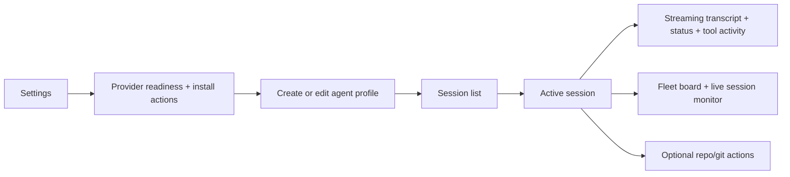
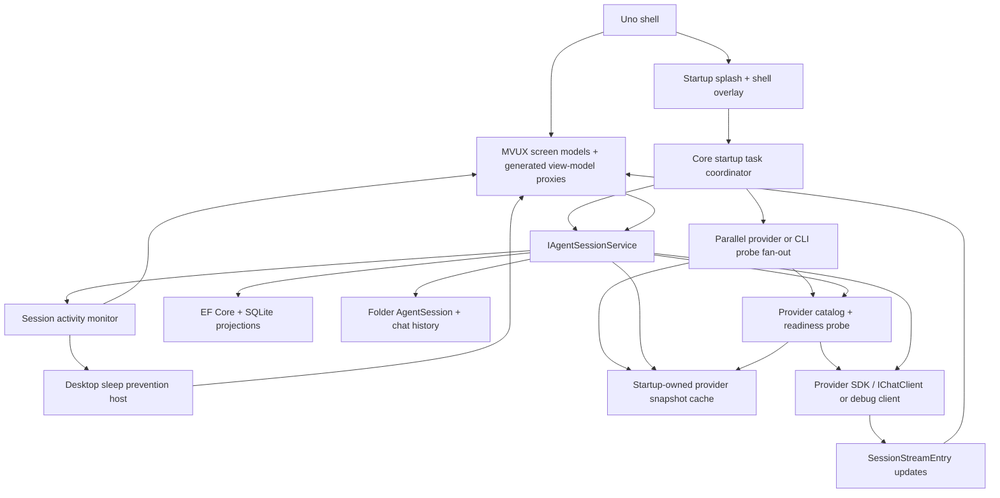
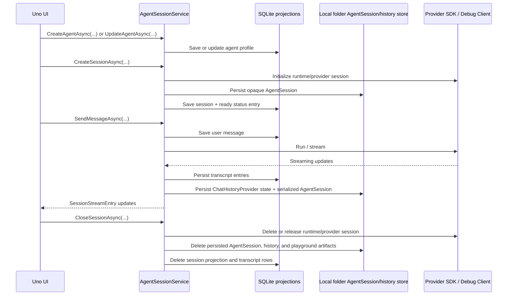

# Architecture Overview

Goal: give humans and agents a fast map of the shipped `DotPilot` direction: a local-first desktop chat app for agent sessions.

This file is the required start-here architecture map for non-trivial tasks.

## Summary

- **Product shape:** `DotPilot` is a desktop chat client for local agent sessions. The default operator flow is: open settings, verify providers, create or edit an agent profile, start or resume a session, send a message, and watch streaming status/tool output in the transcript while the chat info panel surfaces a compact fleet board for live-session visibility and provider health.
- **Presentation boundary:** [../DotPilot/](../DotPilot/) is the `Uno Platform` shell only. It owns desktop startup, routes, XAML composition, `MVUX` screen models plus generated view-model proxies, and visible operator flows such as session list, transcript, agent creation, and provider settings, but it does not own provider startup orchestration or runtime hydration logic.
- **Core boundary:** [../DotPilot.Core/](../DotPilot.Core/) is the shared non-UI contract and application layer. It owns explicit shared roots such as `Identifiers`, `Contracts`, `Models`, `Policies`, and `Workspace`, plus operational slices such as `AgentBuilder`, `ChatSessions`, `Providers`, and `HttpDiagnostics`, including the local session runtime and persistence paths used by the desktop app.
- **Session lifecycle rule:** `CreateSessionAsync` is an eager start, not a placeholder. Creating a chat session must create the durable projection and initialize the backing runtime/provider conversation in the same Core-owned flow. Closing a session must tear down provider/runtime state and local session artifacts before the session disappears from the workspace.
- **Startup initialization rule:** `DotPilot.Core` owns a startup task that fans out one bounded probe per provider/CLI in parallel, keeps a startup snapshot/cache for the current app lifetime, and degrades fast to partial results instead of serially blocking the UI.
- **Live-session desktop rule:** while a session is actively generating, `DotPilot.Core` owns the live-session signal and the desktop host may hold a bounded sleep-prevention lock; the shell must show that state so the operator knows why the machine is being kept awake.
- **Extraction rule:** large non-UI features start in `DotPilot.Core`, but once a slice becomes big enough to need its own boundary, it should move into a dedicated DLL that references `DotPilot.Core`, while the desktop app references that feature DLL directly.
- **Solution-shape rule:** solution folders may group projects by stable categories such as libraries and tests, but extracted subsystems must still keep their own files, namespaces, and project-local rules inside their real project directory.
- **Verification boundary:** [../DotPilot.Tests/](../DotPilot.Tests/) covers caller-visible runtime, persistence, contract, and view-model flows through public boundaries. [../DotPilot.UITests/](../DotPilot.UITests/) covers the desktop operator journey from provider setup to streaming chat.
- **Release website rule:** the desktop release path owns the GitHub Pages publish for [../gh-pages/](../gh-pages/); the site version badge and release download links must resolve from the same CI-derived release version and assets as the GitHub Release.

## Scoping

- **In scope for the active rewrite:** chat-first session UX, provider readiness/settings, agent creation, local persistence via `SQLite`, local folder-backed `AgentSession` and chat-history storage, deterministic debug provider, transcript/tool streaming, and optional repo/git utilities inside a session.
- **In scope for later slices:** multi-agent sessions, richer workflow composition, provider-specific live execution, session export/replay, and deeper git/worktree utilities.
- **Out of scope in the current repository slice:** remote workers, distributed runtime topology, cloud persistence, multi-user identity, and external durable stores.

## Diagrams

### Solution module map

### Operator flow

### Runtime flow

### Persistence and resume shape

## Navigation Index

### Planning and governance

- `Solution governance` — [../AGENTS.md](../AGENTS.md)
- `Uno app rules` — [../DotPilot/AGENTS.md](../DotPilot/AGENTS.md)
- `Core rules` — [../DotPilot.Core/AGENTS.md](../DotPilot.Core/AGENTS.md)
- `Test rules` — [../DotPilot.Tests/AGENTS.md](../DotPilot.Tests/AGENTS.md), [../DotPilot.UITests/AGENTS.md](../DotPilot.UITests/AGENTS.md)

### Modules

- `Production Uno app` — [../DotPilot/](../DotPilot/)
- `Core contracts and shared application code` — [../DotPilot.Core/](../DotPilot.Core/)
- `Unit and integration-style tests` — [../DotPilot.Tests/](../DotPilot.Tests/)
- `UI tests` — [../DotPilot.UITests/](../DotPilot.UITests/)

### High-signal code paths

- `Application startup and route registration` — [../DotPilot/App.xaml.cs](../DotPilot/App.xaml.cs)
- `Chat shell route` — [../DotPilot/Presentation/Chat/Views/ChatPage.xaml](../DotPilot/Presentation/Chat/Views/ChatPage.xaml)
- `Chat info panel + fleet board` — [../DotPilot/Presentation/Chat/Controls/ChatInfoPanel.xaml](../DotPilot/Presentation/Chat/Controls/ChatInfoPanel.xaml), [../DotPilot/Presentation/Chat/Controls/ChatFleetBoard.xaml](../DotPilot/Presentation/Chat/Controls/ChatFleetBoard.xaml)
- `Agent creation route` — [../DotPilot/Presentation/AgentBuilder/Views/AgentBuilderPage.xaml](../DotPilot/Presentation/AgentBuilder/Views/AgentBuilderPage.xaml)
- `Settings shell` — [../DotPilot/Presentation/Settings/Controls/SettingsShell.xaml](../DotPilot/Presentation/Settings/Controls/SettingsShell.xaml)
- `Active contracts` — [../DotPilot.Core/ChatSessions/Contracts/AgentSessionContracts.cs](../DotPilot.Core/ChatSessions/Contracts/AgentSessionContracts.cs)
- `Active commands` — [../DotPilot.Core/ChatSessions/Commands/](../DotPilot.Core/ChatSessions/Commands/)
- `Session service interface` — [../DotPilot.Core/ChatSessions/Interfaces/IAgentSessionService.cs](../DotPilot.Core/ChatSessions/Interfaces/IAgentSessionService.cs)
- `Session application service` — [../DotPilot.Core/ChatSessions/Execution/AgentSessionService.cs](../DotPilot.Core/ChatSessions/Execution/AgentSessionService.cs)
- `Provider metadata + readiness path` — [../DotPilot.Core/Providers/Configuration/AgentProviderKindExtensions.cs](../DotPilot.Core/Providers/Configuration/AgentProviderKindExtensions.cs), [../DotPilot.Core/Providers/Services/AgentProviderStatusSnapshotReader.cs](../DotPilot.Core/Providers/Services/AgentProviderStatusSnapshotReader.cs), [../DotPilot.Core/ChatSessions/Execution/AgentRuntimeConversationFactory.cs](../DotPilot.Core/ChatSessions/Execution/AgentRuntimeConversationFactory.cs)
- `UI end-to-end flow` — [../DotPilot.UITests/ChatSessions/Flows/GivenChatSessionsShell.cs](../DotPilot.UITests/ChatSessions/Flows/GivenChatSessionsShell.cs)

## Review Focus

- Keep the product framed as a chat-first local-agent client, not as a backlog-shaped workbench.
- Replace seed-data assumptions with real provider, agent, session, transcript, and durable runtime state.
- Keep repo/git operations as optional tools inside a session, not as the app's primary information architecture.
- Keep presentation models long-lived and projection-only so desktop navigation stays memory-hot instead of rehydrating each screen from scratch.
- Prefer provider SDKs and `IChatClient`-style abstractions over custom parallel request/result wrappers unless a concrete gap forces an adapter layer.
- Keep the persistence split explicit:
  - `SQLite` for operator-facing projections and settings
  - local folder-backed `AgentSession` plus chat history for agent continuity
