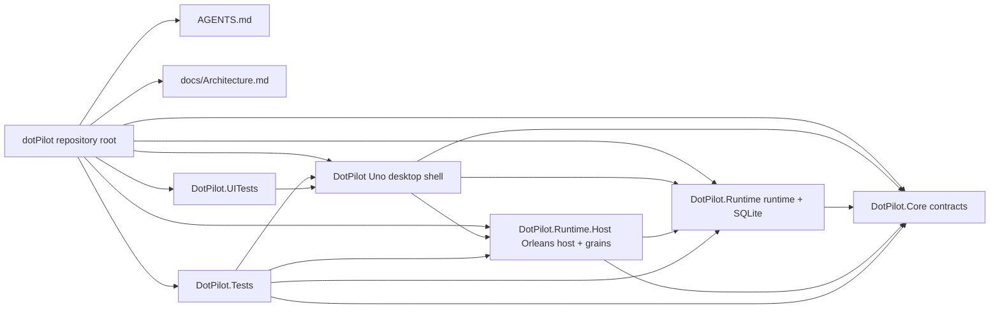
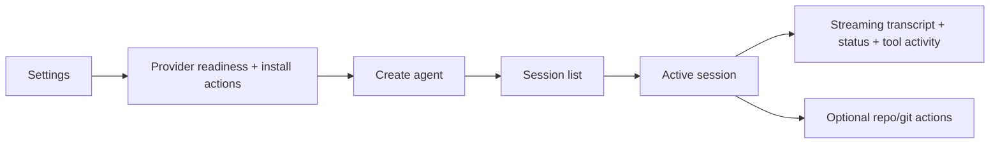
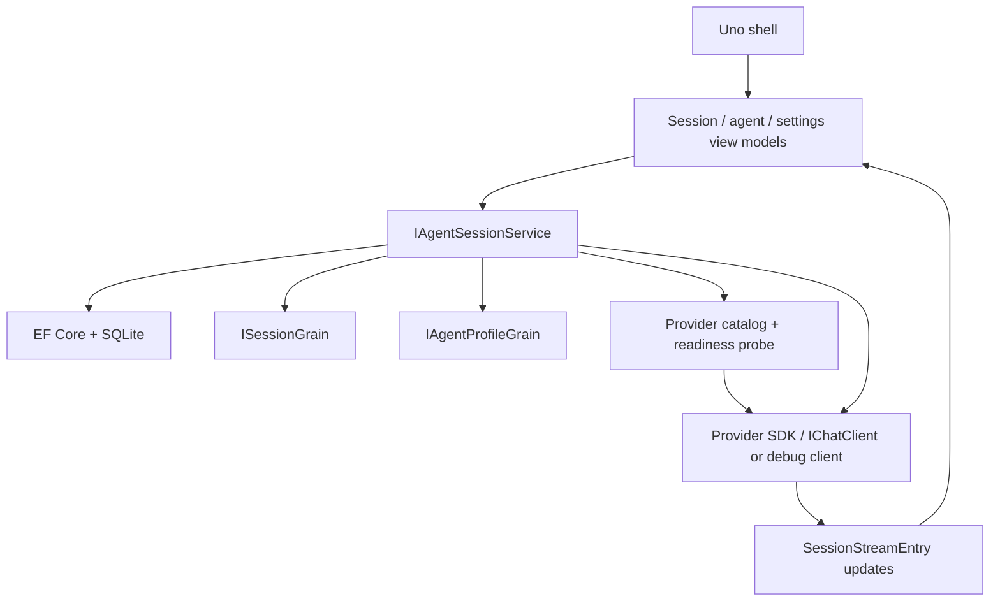
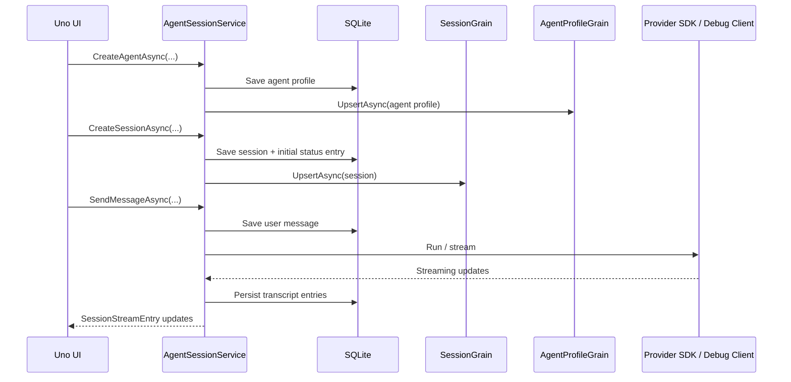

# Architecture Overview

Goal: give humans and agents a fast map of the shipped `DotPilot` direction: a local-first desktop chat app for agent sessions.

This file is the required start-here architecture map for non-trivial tasks.

## Summary

- **Product shape:** `DotPilot` is a desktop chat client for local agent sessions. The default operator flow is: open settings, verify providers, create an agent, start or resume a session, send a message, and watch streaming status/tool output in the transcript.
- **Presentation boundary:** [../DotPilot/](../DotPilot/) is the `Uno Platform` shell only. It owns desktop startup, routes, XAML composition, and visible operator flows such as session list, transcript, agent creation, and provider settings.
- **Contracts boundary:** [../DotPilot.Core/](../DotPilot.Core/) owns the durable non-UI contracts for provider readiness, agent profiles, session lists, transcript entries, commands, and Orleans grain interfaces.
- **Runtime boundary:** [../DotPilot.Runtime/](../DotPilot.Runtime/) owns provider catalogs, CLI readiness checks, deterministic debug-provider behavior, `EF Core` + `SQLite` persistence, and the `IAgentSessionService` implementation.
- **Embedded host boundary:** [../DotPilot.Runtime.Host/](../DotPilot.Runtime.Host/) owns the embedded Orleans host and the grains that represent session and agent-profile state. The first product wave stays local-first with `UseLocalhostClustering` plus in-memory Orleans storage/reminders, while durable product state lives in the local `SQLite` store.
- **Verification boundary:** [../DotPilot.Tests/](../DotPilot.Tests/) covers caller-visible runtime, persistence, contract, and view-model flows through public boundaries. [../DotPilot.UITests/](../DotPilot.UITests/) covers the desktop operator journey from provider setup to streaming chat.

## Scoping

- **In scope for the active rewrite:** chat-first session UX, provider readiness/settings, agent creation, Orleans-backed session and agent state, local persistence via `SQLite`, deterministic debug provider, transcript/tool streaming, and optional repo/git utilities inside a session.
- **In scope for later slices:** multi-agent sessions, richer workflow composition, provider-specific live execution, session export/replay, and deeper git/worktree utilities.
- **Out of scope in the current repository slice:** remote workers, remote Orleans clustering, cloud persistence, multi-user identity, and external durable stores.

## Diagrams

### Solution module map

### Operator flow

### Runtime flow

### Persistence and resume shape

## Navigation Index

### Planning and governance

- `Solution governance` — [../AGENTS.md](../AGENTS.md)
- `Uno app rules` — [../DotPilot/AGENTS.md](../DotPilot/AGENTS.md)
- `Core contracts rules` — [../DotPilot.Core/AGENTS.md](../DotPilot.Core/AGENTS.md)
- `Runtime rules` — [../DotPilot.Runtime/AGENTS.md](../DotPilot.Runtime/AGENTS.md)
- `Embedded host rules` — [../DotPilot.Runtime.Host/AGENTS.md](../DotPilot.Runtime.Host/AGENTS.md)
- `Test rules` — [../DotPilot.Tests/AGENTS.md](../DotPilot.Tests/AGENTS.md), [../DotPilot.UITests/AGENTS.md](../DotPilot.UITests/AGENTS.md)

### Modules

- `Production Uno app` — [../DotPilot/](../DotPilot/)
- `Contracts and typed identifiers` — [../DotPilot.Core/](../DotPilot.Core/)
- `Runtime services and provider adapters` — [../DotPilot.Runtime/](../DotPilot.Runtime/)
- `Embedded Orleans host` — [../DotPilot.Runtime.Host/](../DotPilot.Runtime.Host/)
- `Unit and integration-style tests` — [../DotPilot.Tests/](../DotPilot.Tests/)
- `UI tests` — [../DotPilot.UITests/](../DotPilot.UITests/)

### High-signal code paths

- `Application startup and route registration` — [../DotPilot/App.xaml.cs](../DotPilot/App.xaml.cs)
- `Chat shell route` — [../DotPilot/Presentation/MainPage.xaml](../DotPilot/Presentation/MainPage.xaml)
- `Agent creation route` — [../DotPilot/Presentation/SecondPage.xaml](../DotPilot/Presentation/SecondPage.xaml)
- `Settings shell` — [../DotPilot/Presentation/Controls/SettingsShell.xaml](../DotPilot/Presentation/Controls/SettingsShell.xaml)
- `Active runtime contracts` — [../DotPilot.Core/Features/AgentSessions/AgentSessionContracts.cs](../DotPilot.Core/Features/AgentSessions/AgentSessionContracts.cs)
- `Active runtime commands` — [../DotPilot.Core/Features/AgentSessions/AgentSessionCommands.cs](../DotPilot.Core/Features/AgentSessions/AgentSessionCommands.cs)
- `Session runtime service` — [../DotPilot.Runtime/Features/AgentSessions/AgentSessionService.cs](../DotPilot.Runtime/Features/AgentSessions/AgentSessionService.cs)
- `Provider readiness catalog` — [../DotPilot.Runtime/Features/AgentSessions/AgentSessionProviderCatalog.cs](../DotPilot.Runtime/Features/AgentSessions/AgentSessionProviderCatalog.cs)
- `Session grain` — [../DotPilot.Runtime.Host/Features/AgentSessions/SessionGrain.cs](../DotPilot.Runtime.Host/Features/AgentSessions/SessionGrain.cs)
- `UI end-to-end flow` — [../DotPilot.UITests/Features/AgentSessions/GivenChatSessionsShell.cs](../DotPilot.UITests/Features/AgentSessions/GivenChatSessionsShell.cs)

## Review Focus

- Keep the product framed as a chat-first local-agent client, not as a backlog-shaped workbench.
- Replace seed-data assumptions with real provider, agent, session, and transcript state.
- Keep repo/git operations as optional tools inside a session, not as the app's primary information architecture.
- Prefer provider SDKs and `IChatClient`-style abstractions over custom parallel request/result wrappers unless a concrete gap forces an adapter layer.
