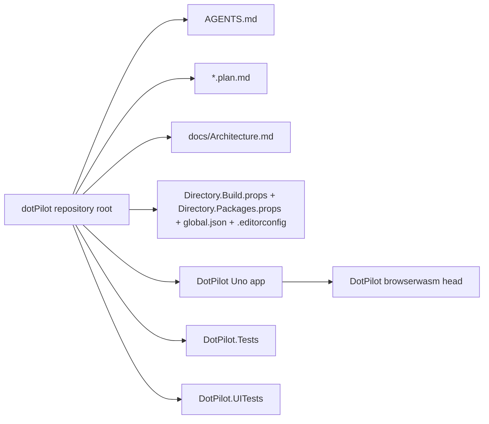
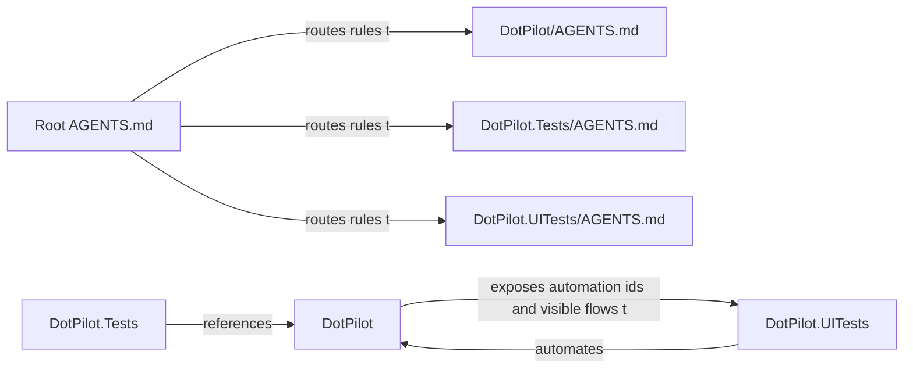
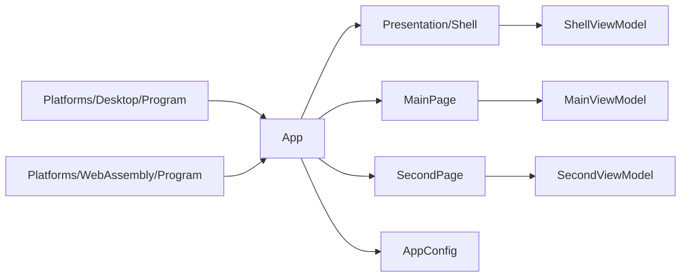

# Architecture Overview

Goal: give humans and agents a fast map of the active `DotPilot` solution, the current `Uno Platform` app boundaries, and the test surfaces that matter before changing code.

This file is the required start-here architecture map for non-trivial tasks.

## Summary

- **System:** `DotPilot` is a `.NET 10` `Uno Platform` application with desktop and `WebAssembly` heads, shared app styling, and two current presentation routes.
- **Production app:** [../DotPilot/](../DotPilot/) contains the `Uno` startup path, route registration, window behavior, and XAML presentation.
- **Automated verification:** [../DotPilot.Tests/](../DotPilot.Tests/) contains in-process `NUnit` tests, and [../DotPilot.UITests/](../DotPilot.UITests/) contains browser-driven `Uno.UITest` smoke coverage.
- **Primary entry points:** [../DotPilot/App.xaml.cs](../DotPilot/App.xaml.cs), [../DotPilot/Platforms/Desktop/Program.cs](../DotPilot/Platforms/Desktop/Program.cs), [../DotPilot/Platforms/WebAssembly/Program.cs](../DotPilot/Platforms/WebAssembly/Program.cs), [../DotPilot/Presentation/Shell.xaml](../DotPilot/Presentation/Shell.xaml), [../DotPilot/Presentation/MainPage.xaml](../DotPilot/Presentation/MainPage.xaml), and [../DotPilot/Presentation/SecondPage.xaml](../DotPilot/Presentation/SecondPage.xaml).

## Scoping

- **In scope:** app startup, route registration, desktop window behavior, shared UI resources, XAML presentation, unit tests, and UI smoke tests.
- **Out of scope:** backend services, persistence, agent runtime protocols, and any platform-specific packaging flow that is not directly needed by the current app shell.
- Start from the diagram that matches the area you will edit, then open only the linked files for that boundary.

## Diagrams

### System / module map

### Interfaces / contracts map

### Key classes / types for the current UI shell

## Navigation Index

### Modules

- `Solution governance` — [../AGENTS.md](../AGENTS.md)
- `Production Uno app` — [../DotPilot/](../DotPilot/)
- `Unit tests` — [../DotPilot.Tests/](../DotPilot.Tests/)
- `UI smoke tests` — [../DotPilot.UITests/](../DotPilot.UITests/)
- `Shared build and analyzer policy` — [../Directory.Build.props](../Directory.Build.props), [../Directory.Packages.props](../Directory.Packages.props), [../global.json](../global.json), and [../.editorconfig](../.editorconfig)
- `Architecture map` — [Architecture.md](./Architecture.md)

### High-signal code paths

- `Desktop startup host` — [../DotPilot/Platforms/Desktop/Program.cs](../DotPilot/Platforms/Desktop/Program.cs)
- `WebAssembly startup host` — [../DotPilot/Platforms/WebAssembly/Program.cs](../DotPilot/Platforms/WebAssembly/Program.cs)
- `Application startup and route registration` — [../DotPilot/App.xaml.cs](../DotPilot/App.xaml.cs)
- `Shared app resources` — [../DotPilot/App.xaml](../DotPilot/App.xaml) and [../DotPilot/Styles/ColorPaletteOverride.xaml](../DotPilot/Styles/ColorPaletteOverride.xaml)
- `Shell` — [../DotPilot/Presentation/Shell.xaml](../DotPilot/Presentation/Shell.xaml)
- `Chat screen` — [../DotPilot/Presentation/MainPage.xaml](../DotPilot/Presentation/MainPage.xaml)
- `Create-agent screen` — [../DotPilot/Presentation/SecondPage.xaml](../DotPilot/Presentation/SecondPage.xaml)
- `Unit test project` — [../DotPilot.Tests/DotPilot.Tests.csproj](../DotPilot.Tests/DotPilot.Tests.csproj)
- `UI smoke harness` — [../DotPilot.UITests/TestBase.cs](../DotPilot.UITests/TestBase.cs) and [../DotPilot.UITests/Constants.cs](../DotPilot.UITests/Constants.cs)
- `UI smoke browser host bootstrap` — [../DotPilot.UITests/BrowserTestHost.cs](../DotPilot.UITests/BrowserTestHost.cs)

## Dependency Rules

- `DotPilot` owns app composition and presentation; keep browser-platform bootstrapping isolated under `Platforms/WebAssembly` and do not bleed browser-only concerns into shared XAML.
- `DotPilot.Tests` may reference `DotPilot` and test-only packages, but should stay in-process and behavior-focused.
- `DotPilot.UITests` owns smoke automation and must not become a dumping ground for product logic or environment assumptions hidden inside test bodies.
- Shared build defaults, analyzer policy, and package versions remain owned by the repo root.

## Key Decisions

- The live product surface is the `DotPilot` `Uno Platform` app, not the older `Pilot.Core` bootstrap.
- Root governance is supplemented by one local `AGENTS.md` file per active project root.
- Navigation is registered centrally in [../DotPilot/App.xaml.cs](../DotPilot/App.xaml.cs) and should remain declarative at the page level where possible.
- Desktop window behavior is configured during app startup, before navigation host activation, when desktop-specific behavior is required.
- `DotPilot.Tests` is the default runnable automated test surface; `DotPilot.UITests` depends on a ChromeDriver path and auto-starts the local `browserwasm` head for smoke coverage.

## Where To Go Next

- Editing the Uno app shell: [../DotPilot/AGENTS.md](../DotPilot/AGENTS.md)
- Editing unit tests: [../DotPilot.Tests/AGENTS.md](../DotPilot.Tests/AGENTS.md)
- Editing UI smoke tests: [../DotPilot.UITests/AGENTS.md](../DotPilot.UITests/AGENTS.md)
- Editing startup and routes: [../DotPilot/App.xaml.cs](../DotPilot/App.xaml.cs)
- Editing screen XAML: [../DotPilot/Presentation/](../DotPilot/Presentation/)
