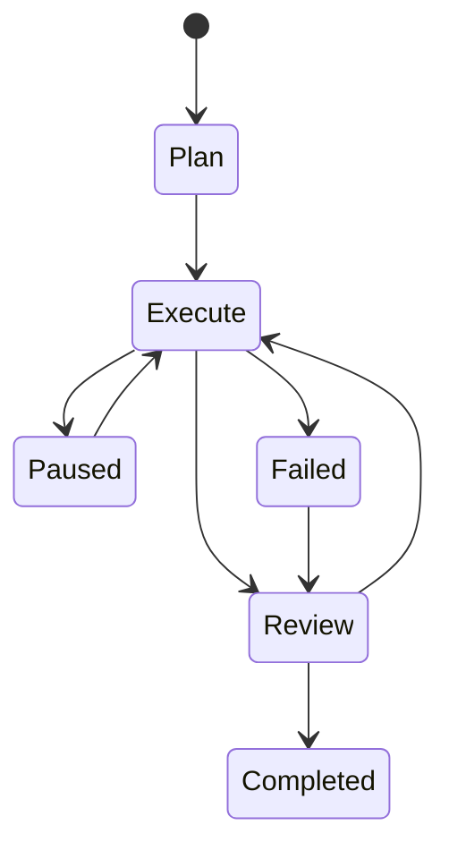

# dotPilot Agent Control Plane Experience

## Summary

`dotPilot` is a desktop-first control plane for local-first agent operations. It must let an operator manage agent profiles, provider toolchains, sessions, files, tools, approvals, telemetry, evaluation, and local runtimes from one workbench.

The product must support coding sessions, but it must not be limited to coding. The same architecture and UI should support research, analysis, orchestration, review, and operator workflows.

## Scope

### In Scope

- desktop workbench shell
- provider toolchain management for `Codex`, `Claude Code`, and `GitHub Copilot`
- session composition for one or many agents
- agent profiles and reusable roles
- repository tree, file viewing, attachments, tool-call visibility, and Git workflows
- MCP/tool federation and repo intelligence
- local runtime selection through `LLamaSharp` and `ONNX Runtime`
- telemetry, evaluation, replay, and policy-aware audit trails

### Out Of Scope

- implementing the actual runtime in this task
- replacing the current Uno shell with a different product layout
- adding `MLXSharp` in the first product wave

## Product Rules

1. `dotPilot` must remain a desktop-first operator workbench, not only a prompt window.
2. The existing shell direction must be preserved:
   - left navigation and workspace tree
   - central session/chat surface
   - right inspector or activity pane
   - dedicated agent-builder/profile surface
3. A session must be able to use:
   - one provider agent
   - many provider agents
   - a mixed provider plus local-model composition
4. The operator must be able to see which provider toolchains are installed, authenticated, outdated, misconfigured, or unavailable.
5. A session must expose plan, execute, and review states explicitly.
6. Files, screenshots, logs, diffs, and generated artifacts must be attachable and inspectable from the workbench.
7. Tool calls, approvals, and diffs must never be hidden behind opaque provider output.
8. Git flows must remain in-app for common operations:
   - status
   - diff
   - stage
   - commit
   - history
   - compare
   - branch or worktree selection
9. Local runtime support must share the same event and session model as remote provider sessions.
10. Telemetry and evaluation must be first-class:
    - OpenTelemetry-first runtime traces
    - quality and safety evaluations through `Microsoft.Extensions.AI.Evaluation*`
    - replay and export for session history
11. `MLXSharp` must not be planned into the first roadmap wave.
12. GitHub backlog items must describe product capability directly and must not mention blocked competitor names.

## Primary Operator Flow

```mermaid
flowchart LR
  Open["Open dotPilot"]
  Check["Open Toolchain Center"]
  Configure["Verify provider versions, auth, settings"]
  Profile["Create or edit agent profile"]
  Compose["Create session and choose participating agents"]
  Work["Browse files, attach context, run plan/execute/review"]
  Approve["Approve tool calls, commands, writes, MCP actions"]
  Inspect["Inspect diffs, artifacts, telemetry, and evaluations"]
  Resume["Pause, resume, branch, or replay session"]

  Open --> Check --> Configure --> Profile --> Compose --> Work --> Approve --> Inspect --> Resume
```

## Session Lifecycle

## Main Behaviour

### Toolchain and Provider Setup

- The operator opens the settings or toolchain center.
- The app detects whether each provider is installed and reachable.
- The app shows:
  - version
  - auth status
  - health status
  - update availability
  - configuration errors
- The operator can run a connection test before starting a session.

### Session Composition

- The operator starts a new session.
- The operator chooses one or more participating agents.
- Each selected agent can bind to:
  - a provider CLI or SDK-backed provider
  - a local model runtime
- The operator can pick role templates such as:
  - coding
  - research
  - analyst
  - reviewer
  - operator
  - orchestrator

### Session Execution

- The operator can browse a repo tree and open files inline.
- The operator can attach files, folders, logs, screenshots, and diffs.
- The session surface must show:
  - conversation output
  - tool calls
  - approvals
  - diffs
  - artifacts
  - branch or workspace context

### Review and Audit

- The operator can inspect agent-generated changes before accepting them.
- The operator can inspect tool-call history and session events.
- The operator can replay or export the session for later inspection.

### Telemetry and Evaluation

- The runtime emits OpenTelemetry-friendly traces, metrics, and logs.
- The operator can inspect a local telemetry view.
- Evaluations can score:
  - relevance
  - groundedness
  - completeness
  - task adherence
  - tool-call accuracy
  - safety metrics where configured

## Edge and Failure Flows

### Provider Missing or Outdated

- If a provider is not installed, the toolchain center must show that state before session creation.
- If a provider is installed but stale, the app must show a warning and available update action.
- If auth is missing, the app must not silently fail during the first live session turn.

### Mixed Session with Partial Availability

- If one selected agent is unavailable, the operator must be told which agent failed and why.
- The operator can remove or replace the failing agent without recreating the entire session conceptually.

### Approval Pause

- When a session reaches an approval gate, it must move to a paused state.
- The operator must be able to resume the same session after approval.

### Local Runtime Failure

- If a local runtime is incompatible with the selected model, the operator must see a compatibility error rather than silent degraded behavior.

### Telemetry or Evaluation Disabled

- The app must continue to function if optional trace export backends are not configured.
- The app must surface which evaluation metrics are active and which are unavailable in the current environment.

## Verification Strategy

### Documentation and Planning Verification

- `docs/Architecture.md` reflects the same boundaries described here.
- `docs/ADR/ADR-0001-agent-control-plane-architecture.md` records the architectural choice and trade-offs.
- GitHub issues map back to the capabilities and flows in this spec.

### Future Product Verification

- `Uno.UITests` cover the workbench shell, toolchain center, session composition, approvals, and Git flows.
- provider-independent runtime and session tests use an in-repo deterministic test client so CI can validate agent flows without external provider CLIs.
- tests that require real `Codex`, `Claude Code`, or `GitHub Copilot` toolchains run only when the matching toolchain is available in the environment.
- UI tests cover each feature's visible interactive elements plus at least one complete operator flow through the affected surface.
- integration tests cover provider adapters, session persistence, replay, and orchestration flows.
- local runtime smoke tests cover `LLamaSharp` and `ONNX Runtime`.
- evaluation harness tests exercise transcript scoring and regression detection.

## Definition of Done

- The repository contains:
  - updated governance reflecting the product direction
  - updated architecture documentation
  - an ADR for the control-plane architecture
  - this executable feature spec
  - a GitHub issue backlog that tracks the approved roadmap as epics plus child issues
- The issue backlog is detailed enough that implementation can proceed feature by feature without re-inventing the scope.
