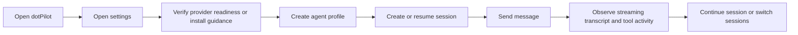
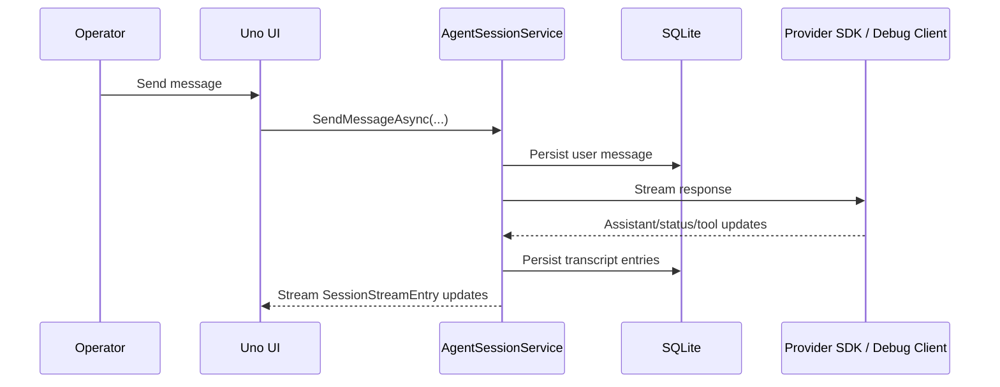

# dotPilot Agent Control Plane Experience

## Summary

`dotPilot` is a desktop-first control plane for local-first agent operations, but its visible product shape is a chat client for sessions. The operator should feel like they are working inside a persistent session with local agents, not bouncing between backlog-shaped product slices.

The product must support coding sessions, but it must not be limited to coding. The same shell should support research, analysis, orchestration, review, and operator workflows.

## Scope

### In Scope

- desktop chat shell with session list, active transcript, and streaming activity
- provider readiness settings for `Codex`, `Claude Code`, `GitHub Copilot`, `ONNX Runtime GenAI`, `LLamaSharp`, and the deterministic debug provider
- agent profiles backed by provider SDK or `IChatClient`-style integrations
- local persistence through `EF Core` + `SQLite`
- visible tool/status streaming in the transcript
- optional repo/git actions as tools inside a session

### Out Of Scope

- cloud orchestration
- distributed runtime topology
- auto-installing provider CLIs without operator confirmation
- adding `MLXSharp` in the first product wave

## Product Rules

1. `dotPilot` must feel like a desktop chat app for local agents, not like a workbench made from backlog slices.
2. Settings are about provider readiness and install guidance, not about separate product centers.
3. A session is the primary container for work and must persist across app restarts.
4. Each agent participating in that experience must have durable identity and configuration outside the UI layer.
5. Provider status must be explicit before live use:
   - installed or missing
   - enabled or disabled
   - ready or blocked
   - install/help command visible when blocked
6. Transcript output must show more than assistant text:
   - user messages
   - assistant messages
   - tool start and completion events
   - status updates
   - error states
7. Repo/git flows are optional tools inside the session experience, not a separate shell.
8. The provider-independent baseline must work through the built-in debug provider so UI tests and CI can always exercise the end-to-end chat flow.

## Primary Operator Flow

## Session Runtime Flow

## Main Behaviour

### Provider Setup

- The operator opens settings.
- The app detects whether each provider CLI is installed and available on `PATH`.
- The app shows:
  - current status summary
  - installed version when available
  - whether agent creation is currently allowed
  - an install/help command when setup is missing
- For local-model providers, settings open a native picker instead of copying a shell command.
- Each local-model provider keeps a persisted catalog of added local models instead of one overwrite-only path.
- The selected local file or folder paths are persisted and reused on later app launches.
- The latest compatible local model becomes the suggested model identifier for agent creation, while every compatible added model appears in the provider's supported-model list and the `New agent` model dropdown.
- `ONNX Runtime GenAI` selection is guided by choosing the model folder's `genai_config.json`, after which the app stores the containing folder path.
- `ONNX Runtime GenAI` readiness requires a readable `genai_config.json` whose `model.type` matches a supported runtime type.
- `LLamaSharp` readiness requires a readable `.gguf` file whose `general.architecture` is supported by the bundled backend; an arbitrary `.gguf` file is not sufficient.
- The deterministic debug provider is always available for local verification.

### Agent Profiles

- The operator creates an agent profile from a natural-language draft and then reviews:
  - provider
  - model
  - tools
  - skills
  - system prompt
- Agent profiles are durable and survive restarts.
- The current shipped flow creates one provider-backed primary agent per session, while the architecture keeps room for later multi-agent expansion.

### Session Execution

- The operator starts or resumes a session from the chat sidebar.
- Starting a session is eager: the app must initialize the backing runtime/provider conversation as part of `CreateSessionAsync`, not defer the real session start to the first message send.
- Each session has durable transcript history.
- Closing a session removes it from the workspace and tears down the backing runtime/provider state plus local persisted session artifacts in the same Core-owned flow.
- The transcript shows:
  - user messages
  - assistant output
  - status entries
  - tool-start entries
  - tool-complete entries
  - errors
- The composer behaves like a terminal-style message input, with visible progress during send and stream.

### Repo and Git Actions

- Repo and git operations can exist as tools invoked inside a session.
- The app only needs the common operator actions in the first wave:
  - create repository
  - fetch
  - pull
  - push
  - merge
  - inspect diffs
- These actions must show up as tool activity or session results, not as a separate product mode.

## Edge and Failure Flows

### Provider Missing

- If a provider is not installed, settings must show that state before agent creation.
- The app must expose the suggested install command instead of silently failing later.

### Local Model Incompatible

- If a local model path points to an unsupported `ONNX Runtime GenAI model.type` or `LLamaSharp GGUF general.architecture`, settings must reject that selection before the operator reaches session send.
- Settings must surface the detected runtime type or architecture and show the supported runtime families so the operator can choose a compatible local model.

### Multiple Local Models

- Adding a second or third local model to `LLamaSharp` or `ONNX Runtime GenAI` must not replace the earlier compatible models for that provider.
- Provider readiness should surface all compatible added models, and the latest added compatible model should become the suggested default.
- Agent profiles saved against those providers must store the chosen model name and resolve it back to the matching local file or folder path at runtime.

### Provider Disabled

- If a provider is disabled, the app must say so explicitly and block agent creation for that provider.

### Session Resume

- If the app restarts, previously persisted sessions and transcript history must still load from the local store.
- A freshly created session must already have its persisted runtime state on disk before the first user message is sent, so restart and resume work immediately after session creation.

### Live Provider Not Yet Wired

- If a provider is configured but live execution is not implemented yet, the session flow must surface that state as an explicit transcript error entry.

### Send-Time Runtime Failure

- If a provider, local model, or runtime fails after the operator presses send, the session flow must persist an explicit transcript error entry immediately instead of leaving the chat looking like it is still running.
- The shell may also show top-level failure feedback, but the transcript itself must become the durable source of truth for that failure state.

### Startup Hydration Failure

- The startup loading overlay may cover the initial hydration attempt only while that attempt is actually running.
- If the first hydration attempt finishes in failure, the shell must exit the loading overlay and surface normal product state instead of looking permanently busy.

## Verification Strategy

- `docs/Architecture.md` reflects the same boundaries described here.
- `docs/ADR/ADR-0001-agent-control-plane-architecture.md` records the session-first desktop architecture and SDK-first provider direction.
- `docs/ADR/ADR-0003-vertical-slices-and-ui-only-uno-app.md` records the presentation-only app boundary and slice layout.
- `DotPilot.Tests` cover provider readiness, agent creation, session creation, and deterministic transcript persistence.
- `DotPilot.UITests` cover the main operator flow:
  1. open app
  2. open settings
  3. enable debug provider
  4. create agent
  5. create session
  6. send message
  7. observe streamed transcript output
