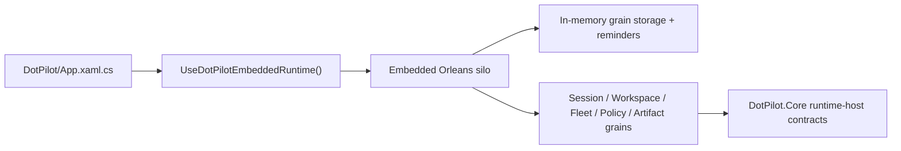

# Embedded Orleans Host

## Summary

Issue [#24](https://github.com/managedcode/dotPilot/issues/24) embeds the first Orleans silo into the desktop runtime path without polluting the Uno UI project or the browserwasm build. The first cut is intentionally local-first: `UseLocalhostClustering`, in-memory grain storage, and in-memory reminders only.

## Scope

### In Scope

- a dedicated `DotPilot.Runtime.Host` class library for Orleans hosting
- Orleans grain interfaces and runtime-host contracts in `DotPilot.Core`
- initial Session, Workspace, Fleet, Policy, and Artifact grains
- desktop startup integration through the Uno host builder
- automated tests for lifecycle, grain round-trips, mismatched keys, and in-memory volatility across restarts

### Out Of Scope

- remote clusters
- external durable storage providers
- Agent Framework orchestration
- UI redesign around the runtime host

## Flow

## Design Notes

- The app references `DotPilot.Runtime.Host` only on non-browser targets so `DotPilot.UITests` and the browserwasm build do not carry the server-only Orleans host.
- `DotPilot.Core` owns the grain interfaces plus the `EmbeddedRuntimeHostSnapshot` contract.
- `DotPilot.Runtime.Host` owns:
  - Orleans host configuration
  - host lifecycle catalog state
  - grain implementations
- The initial cluster configuration is intentionally local:
  - `UseLocalhostClustering`
  - named in-memory grain storage
  - in-memory reminders
- Runtime DTOs used by Orleans grain calls now carry Orleans serializer metadata so the grain contract surface is actually serialization-safe instead of only being plain records.

## Verification

- `dotnet build DotPilot.slnx -warnaserror -m:1 -p:BuildInParallel=false`
- `dotnet test DotPilot.Tests/DotPilot.Tests.csproj --filter FullyQualifiedName~EmbeddedRuntimeHost`
- `dotnet test DotPilot.Tests/DotPilot.Tests.csproj`
- `dotnet test DotPilot.slnx`

## References

- [Architecture Overview](../Architecture.md)
- [ADR-0003: Keep the Uno App Presentation-Only and Move Feature Work into Vertical-Slice Class Libraries](../ADR/ADR-0003-vertical-slices-and-ui-only-uno-app.md)
- [Local development configuration](https://learn.microsoft.com/dotnet/orleans/host/configuration-guide/local-development-configuration)
- [Quickstart: Build your first Orleans app with ASP.NET Core](https://learn.microsoft.com/dotnet/orleans/quickstarts/build-your-first-orleans-app)
