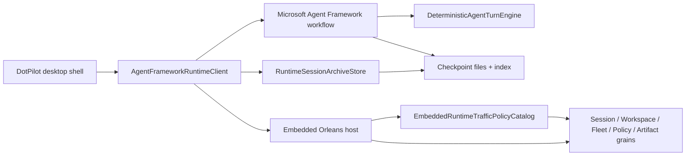
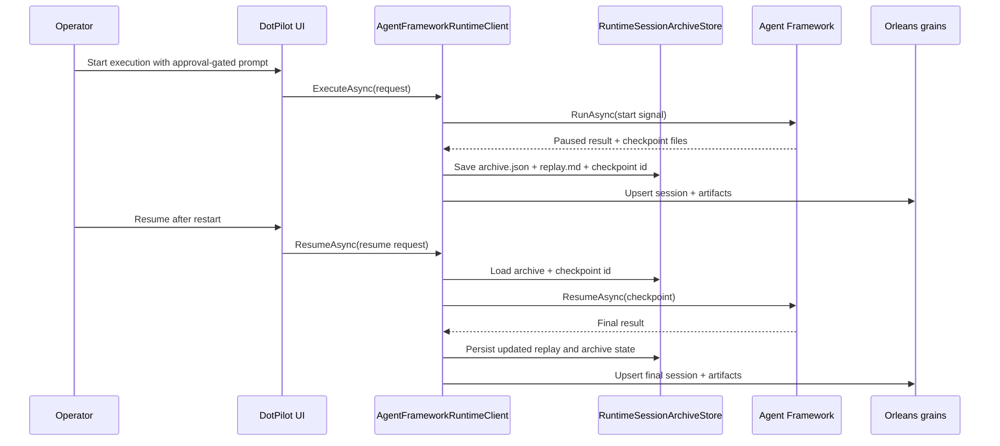

# Embedded Runtime Orchestration

## Summary

Issues [#25](https://github.com/managedcode/dotPilot/issues/25), [#26](https://github.com/managedcode/dotPilot/issues/26), and [#27](https://github.com/managedcode/dotPilot/issues/27) land as one local-first runtime slice on top of the embedded Orleans desktop host. `DotPilot.Runtime` owns the orchestration client, session archive store, and deterministic turn engine; `DotPilot.Runtime.Host` owns the Orleans grains and the explicit traffic-policy catalog.

## Scope

### In Scope

- `Microsoft Agent Framework` as the preferred local orchestration engine for desktop runtime turns
- explicit traffic-policy visibility for session, workspace, fleet, policy, and artifact grains
- local-first session archive persistence with replay markdown, checkpoint files, and restart-safe resume
- deterministic execution and approval-gated flows that stay testable in CI without external providers

### Out Of Scope

- remote Orleans clustering or durable Orleans storage providers
- provider-specific orchestration adapters
- hiding runtime state inside the Uno app project

## Flow

## Session Resume Flow

## Design Notes

- The orchestration boundary stays in `DotPilot.Runtime`, not in the Uno app, so desktop startup remains presentation-only.
- `AgentFrameworkRuntimeClient` uses `Microsoft.Agents.AI.Workflows` for run orchestration, checkpoint storage, and resume semantics.
- `RuntimeSessionArchiveStore` persists three operator-facing artifacts per session:
  - `archive.json`
  - `replay.md`
  - checkpoint files under `checkpoints/`
- The implementation explicitly waits for checkpoint materialization before archiving paused sessions because the workflow run halts before checkpoint files are always observable from `Run.LastCheckpoint`.
- `#26` asked for `ManagedCode.Orleans.Graph`, but the current public package targets Orleans `9.x` while this repository is pinned to Orleans `10.0.1`. The runtime therefore exposes an explicit `EmbeddedRuntimeTrafficPolicyCatalog` plus Mermaid graph output now, while keeping the policy boundary ready for a future package-compatible graph implementation.
- Browser and deterministic paths stay available, so CI can validate the runtime slice without external CLI providers or auth.

## Verification

- `dotnet build DotPilot.slnx -warnaserror -m:1 -p:BuildInParallel=false`
- `dotnet test DotPilot.Tests/DotPilot.Tests.csproj --filter FullyQualifiedName~RuntimeFoundation`
- `dotnet test DotPilot.Tests/DotPilot.Tests.csproj`
- `dotnet test DotPilot.slnx`
- `dotnet test DotPilot.Tests/DotPilot.Tests.csproj --settings DotPilot.Tests/coverlet.runsettings --collect:"XPlat Code Coverage"`

## References

- [Architecture Overview](../Architecture.md)
- [Embedded Orleans Host](./embedded-orleans-host.md)
- [ADR-0001: Agent Control Plane Architecture](../ADR/ADR-0001-agent-control-plane-architecture.md)
- [ADR-0003: Keep the Uno App Presentation-Only and Move Feature Work into Vertical-Slice Class Libraries](../ADR/ADR-0003-vertical-slices-and-ui-only-uno-app.md)
