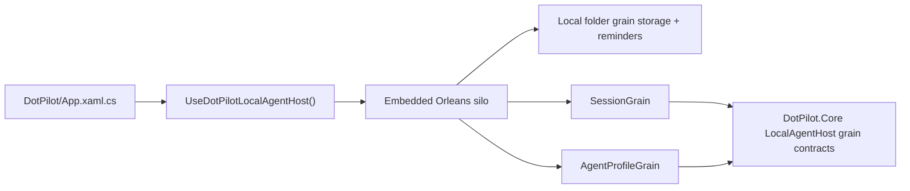

# Local Agent Host

## Summary

`DotPilot.Core/LocalAgentHost` embeds the Orleans silo used by the desktop app path without spreading grain contracts and host wiring across separate projects. The current cut is intentionally local-first: `UseLocalhostClustering`, local folder-backed grain storage, and in-memory reminders only.

## Scope

### In Scope

- a dedicated `LocalAgentHost` slice inside `DotPilot.Core`
- Orleans grain interfaces for agent profiles and sessions next to the host implementation in `DotPilot.Core/LocalAgentHost/Grains`
- `AgentProfileGrain` and `SessionGrain`
- desktop startup integration through the Uno host builder
- automated tests for lifecycle, grain round-trips, mismatched keys, and in-memory volatility across restarts

### Out Of Scope

- remote clusters
- external durable Orleans storage providers
- moving durable transcript persistence into Orleans storage
- UI redesign around the runtime host

## Flow

## Design Notes

- The app references only `DotPilot.Core`; the local host stays inside the core slice instead of being split into a separate project.
- `DotPilot.Core/LocalAgentHost` owns:
  - Orleans host configuration
  - host option names
  - grain interfaces
  - grain implementations
- The initial cluster configuration is intentionally local:
  - `UseLocalhostClustering`
  - local folder-backed grain storage
  - in-memory reminders
- Durable transcript history and provider settings live in sibling core folders through `SQLite`; Orleans stores only the in-cluster session and agent grain state for this product wave.

## Verification

- `dotnet build DotPilot.slnx -warnaserror -m:1 -p:BuildInParallel=false`
- `dotnet test DotPilot.Tests/DotPilot.Tests.csproj --filter FullyQualifiedName~AgentSessions`
- `dotnet test DotPilot.Tests/DotPilot.Tests.csproj`
- `dotnet test DotPilot.slnx`

## References

- [Architecture Overview](../Architecture.md)
- [ADR-0003: Keep the Uno App Presentation-Only and Move Feature Work into Vertical-Slice Class Libraries](../ADR/ADR-0003-vertical-slices-and-ui-only-uno-app.md)
- [Local development configuration](https://learn.microsoft.com/dotnet/orleans/host/configuration-guide/local-development-configuration)
- [Quickstart: Build your first Orleans app with ASP.NET Core](https://learn.microsoft.com/dotnet/orleans/quickstarts/build-your-first-orleans-app)
