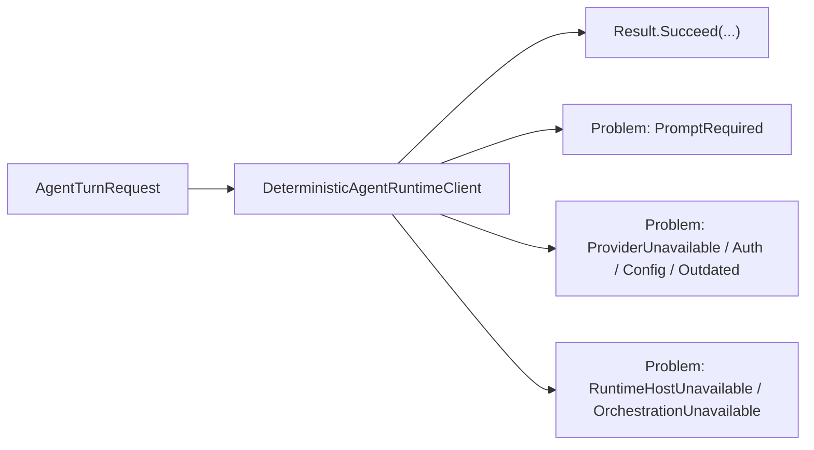

# Runtime Communication Contracts

## Summary

Issue [#23](https://github.com/managedcode/dotPilot/issues/23) standardizes the first public runtime success and failure contracts on top of `ManagedCode.Communication`. This gives the control plane one explicit result language for deterministic runtime flows now, and for provider adapters, embedded hosting, and orchestration later.

## Scope

### In Scope

- `ManagedCode.Communication` as the shared result and problem package for public runtime boundaries
- typed runtime communication problem codes for validation, provider readiness, runtime-host availability, orchestration availability, and policy rejection
- `Result<AgentTurnResult>` as the first public runtime boundary used by the deterministic runtime client
- documentation and tests that prove both success and failure flows

### Out Of Scope

- end-user copywriting for every eventual UI error state
- provider adapter implementation
- Orleans host implementation
- Agent Framework orchestration implementation

## Flow

## Contract Notes

- `RuntimeCommunicationProblemCode` is the stable typed error-code set for the first communication boundary.
- `RuntimeCommunicationProblems` centralizes `Problem` creation so later provider, host, and orchestration slices do not drift into ad hoc error construction.
- Validation now returns a failed `Result<AgentTurnResult>` with a field-level error on `Prompt` instead of throwing for expected bad input.
- Provider-readiness failures are encoded as typed problems mapped from `ProviderConnectionStatus`, which keeps the failure language aligned with the domain model from issue `#22`.
- Approval pauses remain successful results because they are a valid runtime state transition, not an error.

## Verification

- `dotnet test DotPilot.Tests/DotPilot.Tests.csproj`
- `dotnet test DotPilot.slnx`

## Dependencies

- Parent epic: [#11](https://github.com/managedcode/dotPilot/issues/11)
- Depends on: [#22](https://github.com/managedcode/dotPilot/issues/22)
- Follow-up host/runtime slices: [#24](https://github.com/managedcode/dotPilot/issues/24), [#25](https://github.com/managedcode/dotPilot/issues/25)
