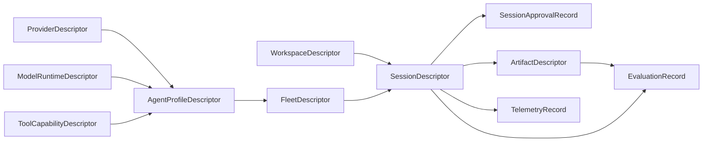

# Shared Core Types

## Summary

Issue [#22](https://github.com/managedcode/dotPilot/issues/22) defines the first stable shared contracts that later runtime, communication, and orchestration slices will share. The goal is to keep these shapes broad enough for coding and non-coding agents while staying serialization-safe and independent from the Uno UI host.

## Scope

### In Scope

- typed identifiers for workspaces, agents, sessions, fleets, providers, runtimes, tools, approvals, artifacts, telemetry, and evaluations
- shared state enums for session lifecycle, provider readiness, approval status, execution modes, artifacts, telemetry, and evaluation outcomes
- DTO-style records for workspaces, agents, fleets, providers, runtimes, sessions, approvals, artifacts, telemetry, and evaluations
- references from runtime-foundation contracts back into this domain slice

### Out Of Scope

- live provider execution or SDK adapters
- transport contracts for issue `#23`

## Relationships

## Contract Notes

- `CoreIdentifiers` use `Guid.CreateVersion7()` so new IDs are sortable and modern without leaking UI concerns into the shared core types.
- DTOs are modeled as non-positional `sealed record` types with `init` properties and safe defaults so `System.Text.Json` can round-trip them without custom infrastructure.
- `ProviderConnectionStatus` includes non-happy-path states such as `RequiresAuthentication`, `Misconfigured`, and `Outdated` because the operator UI must surface these explicitly before live sessions start.
- `AgentProfileDescriptor` supports mixed provider and local-runtime participation by allowing either `ProviderId`, `ModelRuntimeId`, or both depending on future orchestration needs.
- `SessionDescriptor`, `SessionApprovalRecord`, `ArtifactDescriptor`, `TelemetryRecord`, and `EvaluationRecord` carry the minimum shared flow data needed by issues `#23`, `#24`, and `#25`.

## Verification

- `dotnet test DotPilot.Tests/DotPilot.Tests.csproj --filter FullyQualifiedName~SharedTypes`
- `dotnet test DotPilot.Tests/DotPilot.Tests.csproj`
- `dotnet test DotPilot.slnx`

## Dependencies

- Parent epic: [#11](https://github.com/managedcode/dotPilot/issues/11)
- Runtime communication follow-up: [#23](https://github.com/managedcode/dotPilot/issues/23)
- Embedded host follow-up: [#24](https://github.com/managedcode/dotPilot/issues/24)
- Agent Framework follow-up: [#25](https://github.com/managedcode/dotPilot/issues/25)
