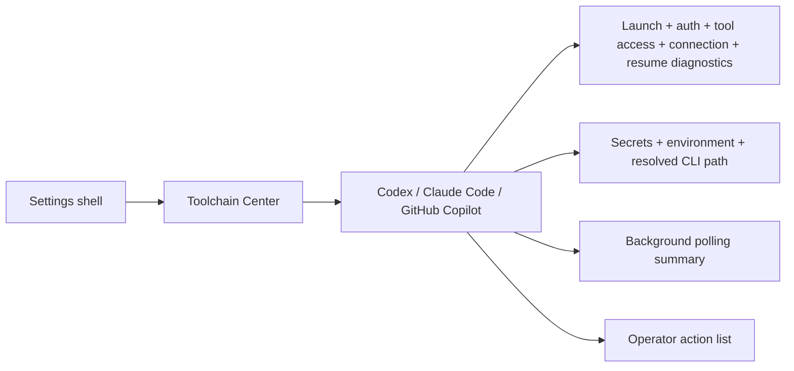

# Toolchain Center

## Summary

Epic [#14](https://github.com/managedcode/dotPilot/issues/14) adds a first-class Toolchain Center for `Codex`, `Claude Code`, and `GitHub Copilot`. The slice gives the operator one desktop surface to inspect installation state, version visibility, authentication readiness, connection diagnostics, provider configuration, and background polling before a live session starts.

## Scope

### In Scope

- Toolchain Center shell and detail surface for issue [#33](https://github.com/managedcode/dotPilot/issues/33)
- `Codex` readiness, version, auth, and operator actions for issue [#34](https://github.com/managedcode/dotPilot/issues/34)
- `Claude Code` readiness, version, auth, and operator actions for issue [#35](https://github.com/managedcode/dotPilot/issues/35)
- `GitHub Copilot` readiness, CLI or SDK prerequisite visibility, and operator actions for issue [#36](https://github.com/managedcode/dotPilot/issues/36)
- Connection-test and health-diagnostic modeling for issue [#37](https://github.com/managedcode/dotPilot/issues/37)
- Secrets and environment configuration modeling for issue [#38](https://github.com/managedcode/dotPilot/issues/38)
- Background polling summaries and stale-state surfacing for issue [#39](https://github.com/managedcode/dotPilot/issues/39)

### Out Of Scope

- live provider session execution
- remote version feeds or package-manager-driven auto-update workflows
- secure secret storage beyond current environment and local configuration visibility
- local model runtimes outside the external provider toolchain path

## Flow

## Contract Notes

- `DotPilot.Core/Features/ToolchainCenter` owns the provider-agnostic contracts for readiness state, version status, auth state, health state, diagnostics, configuration entries, actions, workstreams, and polling summaries.
- `DotPilot.Runtime/Features/ToolchainCenter` owns provider profile definitions and side-effect-bounded CLI probing. The slice reads local executable metadata and environment signals only; it does not start real provider sessions.
- The Toolchain Center is the default settings category so provider readiness is visible without extra drilling after the operator enters settings.
- Provider configuration must stay visible without leaking secrets. Secret entries show status only, while non-secret entries can show the current resolved value.
- Background polling is represented as operator-facing state, not a hidden implementation detail. The UI must tell the operator when readiness was checked and when the next refresh will run.
- Missing or incomplete provider readiness is a surfaced state, not a fallback path. The app keeps blocked, warning, and action-required states explicit.

## Verification

- `dotnet build DotPilot.slnx -warnaserror -m:1 -p:BuildInParallel=false`
- `dotnet test DotPilot.Tests/DotPilot.Tests.csproj`
- `dotnet test DotPilot.UITests/DotPilot.UITests.csproj`
- `dotnet test DotPilot.slnx`

## Dependencies

- Parent epic: [#14](https://github.com/managedcode/dotPilot/issues/14)
- Child issues: [#33](https://github.com/managedcode/dotPilot/issues/33), [#34](https://github.com/managedcode/dotPilot/issues/34), [#35](https://github.com/managedcode/dotPilot/issues/35), [#36](https://github.com/managedcode/dotPilot/issues/36), [#37](https://github.com/managedcode/dotPilot/issues/37), [#38](https://github.com/managedcode/dotPilot/issues/38), [#39](https://github.com/managedcode/dotPilot/issues/39)
