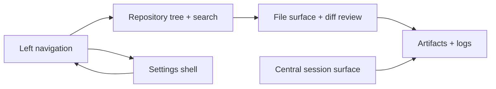

# Workbench Foundation

## Summary

Epic [#13](https://github.com/managedcode/dotPilot/issues/13) turns the current static Uno shell into the first real operator workbench. The slice keeps the existing desktop-first information architecture, but replaces prototype-only assumptions with a runtime-backed repository tree, file surface, artifact and log inspection, and a first-class settings shell.

## Scope

### In Scope

- primary three-pane workbench shell for issue `#28`
- gitignore-aware repository tree with search and open-file navigation for issue `#29`
- file viewer and diff-review surface aligned with a Monaco-style editor contract for issue `#30`
- artifact dock and runtime log console for issue `#31`
- unified settings shell for providers, policies, and storage for issue `#32`

### Out Of Scope

- provider runtime execution
- Orleans host orchestration
- persistent session replay
- full IDE parity

## Flow

## Contract Notes

- The Uno app stays presentation-only; workbench data, repository scanning, and settings descriptors come from app-external feature slices.
- Browser UI tests need deterministic data, so the workbench runtime path must provide browser-safe seeded content when direct filesystem access is unavailable.
- Repository navigation, file inspection, diff review, artifact inspection, and settings navigation are treated as one operator flow rather than isolated widgets.
- The file surface is designed around a Monaco-style editor contract even when the current renderer remains constrained by cross-platform Uno surfaces.

## Verification

- `dotnet test DotPilot.Tests/DotPilot.Tests.csproj`
- `dotnet test DotPilot.UITests/DotPilot.UITests.csproj`
- `dotnet test DotPilot.slnx`

## Dependencies

- Parent epic: [#13](https://github.com/managedcode/dotPilot/issues/13)
- Child issues: [#28](https://github.com/managedcode/dotPilot/issues/28), [#29](https://github.com/managedcode/dotPilot/issues/29), [#30](https://github.com/managedcode/dotPilot/issues/30), [#31](https://github.com/managedcode/dotPilot/issues/31), [#32](https://github.com/managedcode/dotPilot/issues/32)
